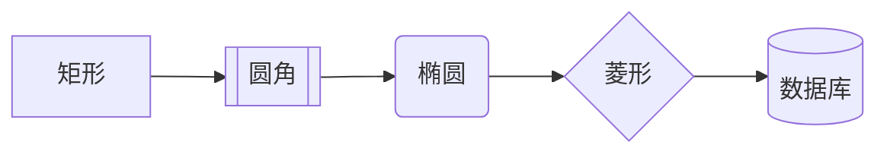
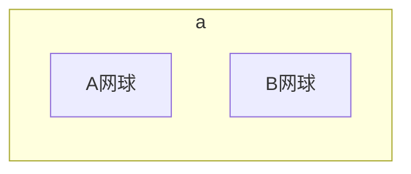
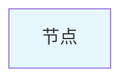
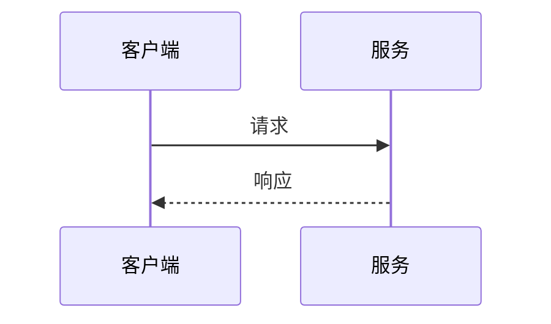
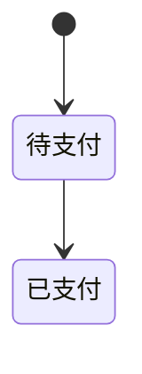
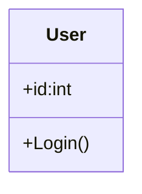
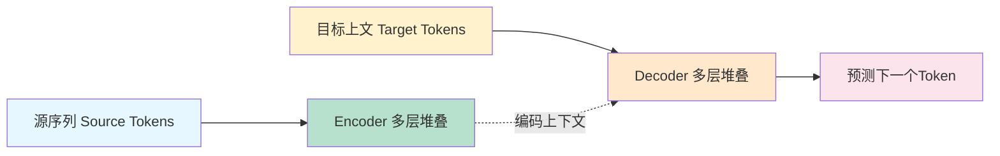

# Mermaid 极简速查

## 1. flowchart 流程图【架构首选】

### 布局方向

LR 左→右｜TD 上→下｜RL 右→左｜BT 下→上

连线：
`A --> B` 实线
`A -.-> B` 虚线
`A --文字--> B` 带标注

子图分组

自定义颜色

注释：`%% 注释内容`

## 2. sequenceDiagram 时序图（接口交互）

## 4. stateDiagram-v2 状态机

## 6. classDiagram 类图

4. 复杂C4、gitgraph兼容性差，优先flowchart

## Transformer LR 成品模板

## 花括号

$\underbrace {下方}$

$\overbrace {上方}$

$\left \{ \begin{aligned} 左边 \end{aligned} \right.$     $f(x)=\left\{ \begin{aligned} f(\boldsymbol{x}) &= \boldsymbol{x}^\top A \boldsymbol{x}\\ \boldsymbol{x}&\in\mathbb{R}^n\\ A&\in\mathbb{R}^{n\times n} \end{aligned} \right.$

$$
\left.
\begin{aligned}
f(\boldsymbol{x}) &= \boldsymbol{x}^\top A \boldsymbol{x}\\
\boldsymbol{x}&\in\mathbb{R}^n\\
A&\in\mathbb{R}^{n\times n}
\end{aligned}
\right\} =f(x)
$$

