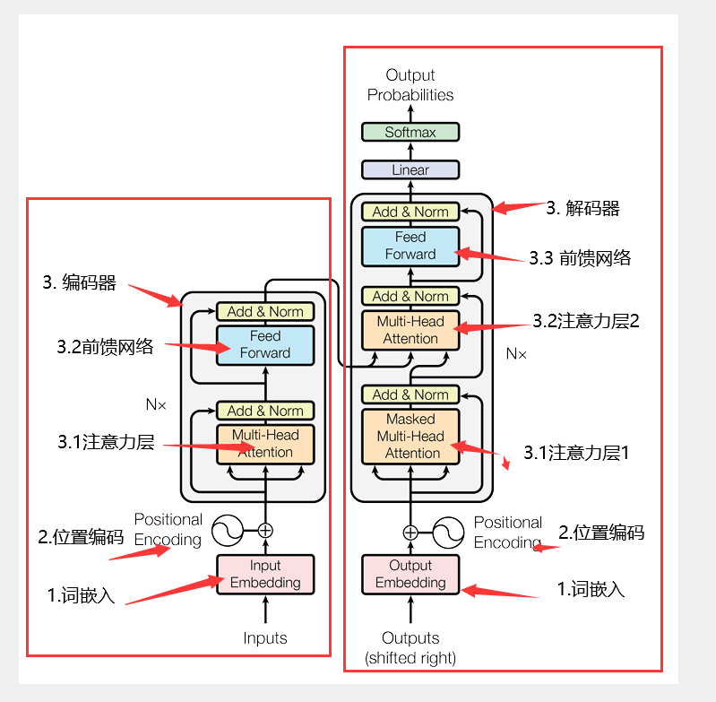
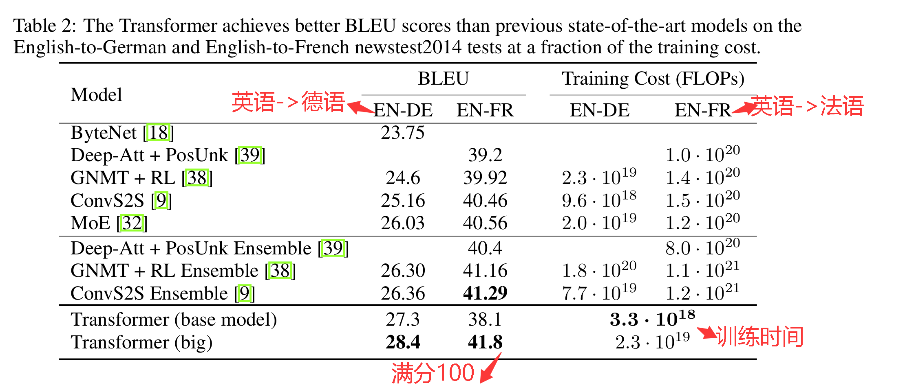
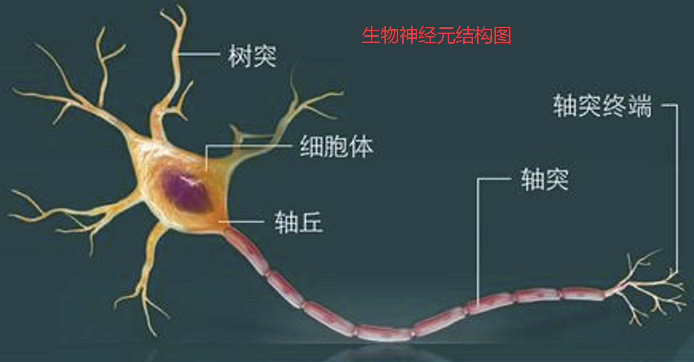
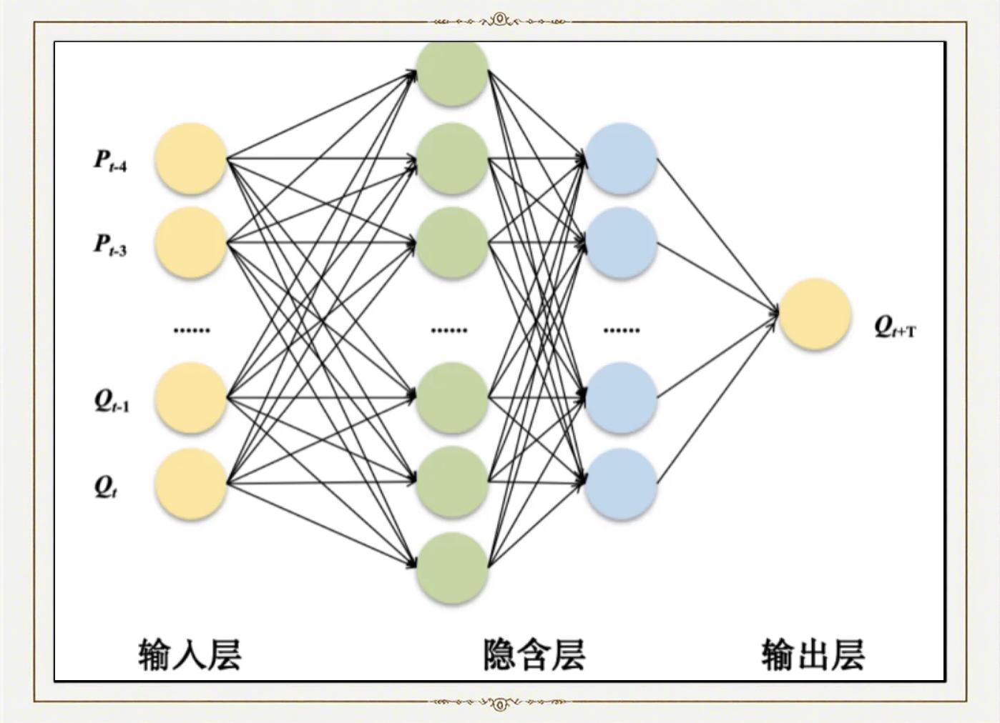
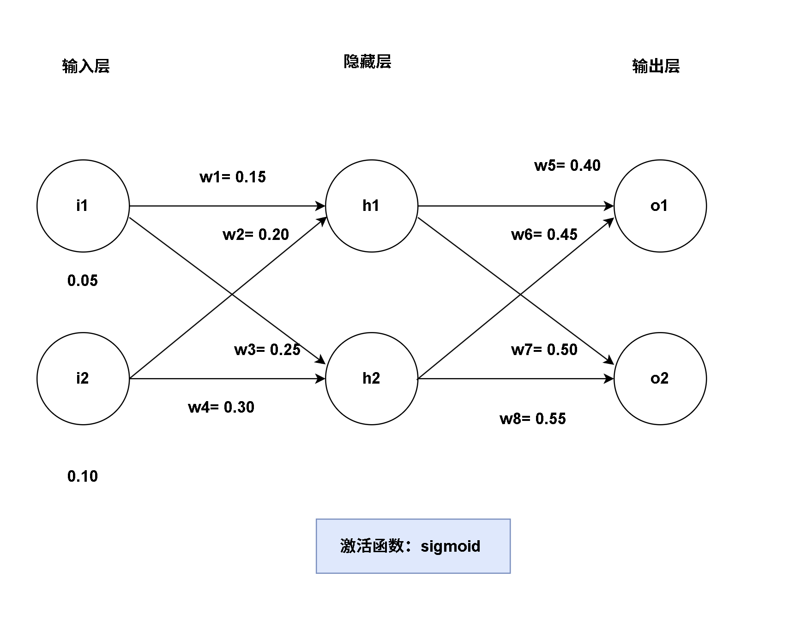
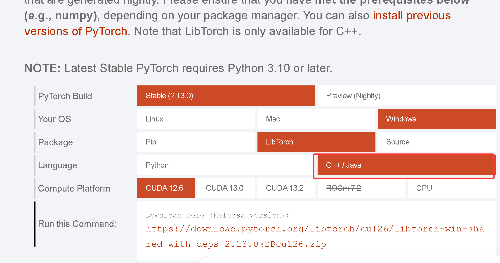
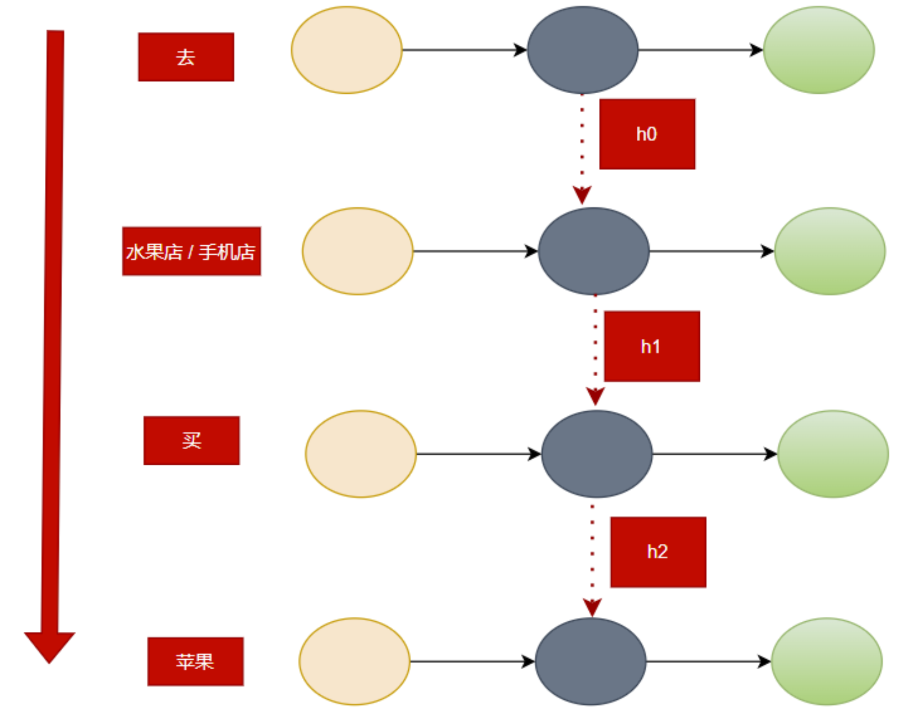
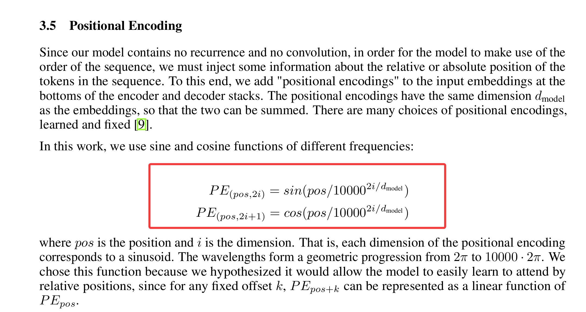
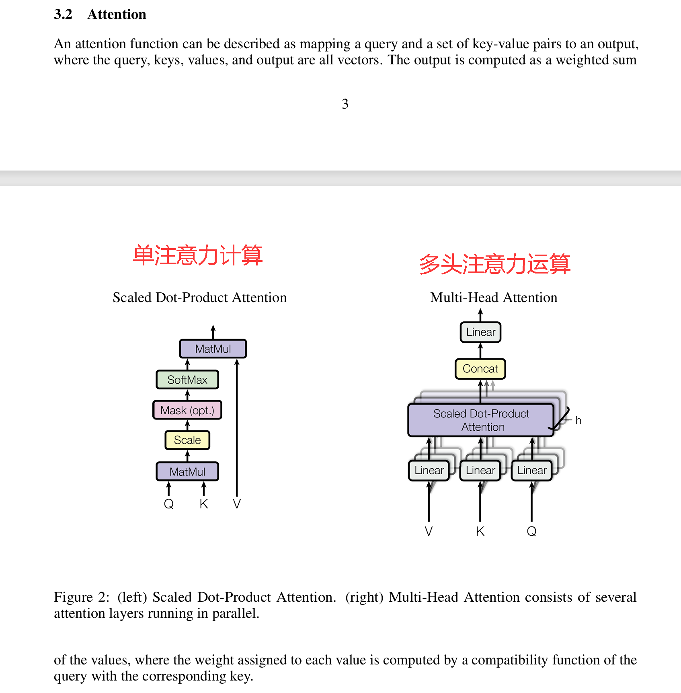
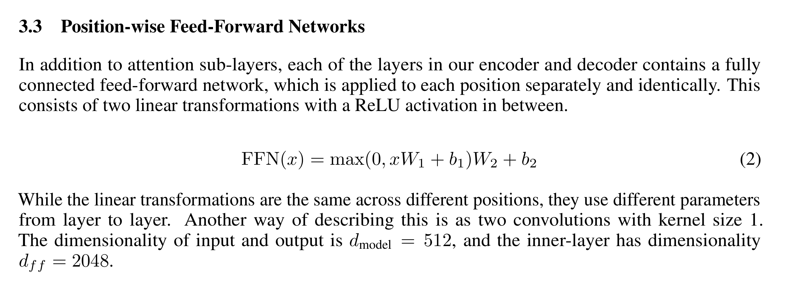

# 简介

## 1.Transformer 的起源

- **论文：** [Attention Is All You Need](https://arxiv.org/pdf/1706.03762)

Transformer 诞生于 2017 年。Google 研究团队在《Attention Is All You Need》中首次提出了 Transformer 架构。当时的机器翻译通常采用 RNN、LSTM、CNN 等模型，主要存在两个痛点：

   **1. 一个词一个词地处理(串行处理) 难以并行运算**
    **2. 长序列中的早期信息容易衰减，难以捕获长程依赖**

Transformer 不再以 RNN 或 CNN 为主干，而是以**注意力机制（Attention)** 为核心，显著改善了这两个问题。

<div style="page-break-before: always;"></div>

## 2. Transformer 模型架构



<div style="page-break-before: always;"></div>

## 3. Transformer在当时测试成绩



Transformer不管翻译质量还是训练速度显著强于当时商用翻译软件。

<div style="page-break-before: always;"></div>

## 4. Transformer在当代AI的地位

Transformer 是当前人工智能领域最核心、最有影响力的技术架构之一，也是现代生成式 AI 的重要底座。GPT、Llama、Qwen、Claude、DeepSeek 等主流大语言模型均以 Transformer 或其变体为基础。

<div style="page-break-before: always;"></div>

## 5. 本章讲解内容

> 语言标准：C++20/17  
> 深度学习框架：libtorch
> 开发工具：VS2022

 [1. 神经网络基础](#1-神经网络基础)

 [2. 词嵌入](#2-词嵌入embedding)

 [3. 位置编码](#3-位置编码)

 [4. 注意力(Attention)运算](#4-注意力attention运算)

 [5. Transformer整体架构](#5-transformer整体架构)

 [6.基于Transformer实现翻译例子](#6-基于transformer实现翻译例子)

<div style="page-break-before: always;"></div>

# 1. 神经网络基础

## 生物神经元



生物神经元结构：

- **树突** 接收来自其他神经元的信号（输入信号）

- **细胞体** 把所有信号叠加整合（加权求和）

- **轴突** 放电产生电脉冲，向外输出信号 （激活函数）

- **突触** 神经元之间的连接缝隙，**突触强度可以变化**

人类学习过程： 感知→反馈→记忆

- 感知：接收外界信息（输入信号 ），
- 反馈：轴突输出结果与实际反馈
- 记忆:  修改突触连接强度 再回到感知，循环往复。

<div style="page-break-before: always;"></div>

## 人工神经网络

人工神经网络是**受生物神经元连接启发的数学模型**。大量神经元按特定连接方式构成机器学习模型；一个人工神经元通常包括 5 个部分：**输入、权重、加权求和与偏置、激活函数、输出**。

- **输入** **$\boldsymbol x = [x_1,x_2,\dots,x_n]$**  对应生物神经元**树突**。

- **权重 $\boldsymbol w = [w_1,w_2,\dots,w_n]$** 对应生物神经元**突触**

- **加权求和 + 偏置** ：对输入进行**线性变换**，对应生物神经元**细胞体**。

- **激活函数** ：对线性变换结果施加**非线性变换**并输出结果，对应生物神经元的**细胞体、轴突**。

由多个神经元组成称神经网络 一般分为三层： **输入层、隐藏层、输出层**




 **某一层的数学表示：** $\boldsymbol y= \boldsymbol f(\boldsymbol w \boldsymbol x + \boldsymbol b)$

<div style="page-break-before: always;"></div>

## 神经网络示例



**激活函数 sigmoid：** $y=\operatorname{sigmoid}(x)=\dfrac{1}{1+e^{-x}}$，其中 $y\in(0,1)$。


神经网络示例： 输入数据$[0.05,0.10]$ ，期望输出(**真实标签**)$[0.1,0.99]$ ，**求解神经网络的权重？**


**初始化数据**

```c++
  double i1 = 0.05;
  double i2 = 0.1;
  double w1 = 0.15;
  double w2 = 0.2;
  double w3 = 0.25;
  double w4 = 0.3;
  double w5 = 0.4;
  double w6 = 0.45;
  double w7 = 0.5;
  double w8 = 0.55;
  double b1 = 0.35;
  double b2 = 0.35;
  double b3 = 0.6;
  double b4 = 0.6;

  double o1 = 0.01;
  double o2 = 0.99;
```


**神经网络计算过程（前向传播）**  

$\begin{cases}h1=i1*w1+i2*w2+b1 \\ h2=i1*w3+i2*w4+b2 \\
o1= sigmoid(h1)*w5+sigmoid(h2)*w6 +b3\\
o2= sigmoid(h1)*w7+sigmoid(h2)*w8+ b4\\
o1= sigmoid(o1)\\
o2= sigmoid(o2)\\
\end{cases}$

**前向传播：** 指的是数据输入的神经网络中，逐层向前传输，一直到运算到输出层为止。

对应代码：

```
/// 加权求和 + 偏置
double YFunction(double x1, double w1, double x2, double w2, double b)
{
    double y = x1 * w1 + x2 * w2 + b;
    return y;
}
/// 激活函数
double sigmoid(double x)
{

    return 1.0 / (1.0 + std::exp(-x));
}

///前向传播 计算过程

        neth1 = YFunction(i1,w1,i2,w2,b1);
        neth2 = YFunction(i1, w3, i2, w4, b2);
        outh1 = sigmoid(neth1);
        outh2 = sigmoid(neth2);

        nety1 = YFunction(outh1, w5, outh2, w6, b3);
        nety2 = YFunction(outh1, w7, outh2, w8, b4);

        outy1 = sigmoid(nety1);
        outy2 = sigmoid(nety2);


```


## 损失函数

数据经过神经网络处理最终得到的预测值与真实标签之间的误差大小。损失函数使用均方误差 MSE

$\mathcal L=\frac12(\hat y-y)^2$ 其中 $\hat y$表示预测值，$y$表示真实值

```
double Loss(double y, double targetY)
{

    return 0.5 * (y - targetY) * (y - targetY);
}
```


## 反向传播

从损失函数出发，向后逐层计算损失对每一个权重、偏置的偏导数（梯度），告诉每个参数应该增大还是减小，再用梯度下降更新参数。

如对$w5$参数更新：

- 对$w5$ 求偏导  原函数 $\begin{cases} nety1_{w5}= sigmoid(h1)*w5 +sigmoid(h2)*w6 +b3\\outy1_{w5}= sigmoid(nety1) \\
  o1Loss_{w5}=\frac12(outy1-o1)^2 \\ \end{cases}$
- 根据链式法则：$\dfrac{\partial \mathcal L}{\partial w_5}=\dfrac{\partial \mathcal L}{\partial outy1}\dfrac{\partial outy1}{\partial nety1}\dfrac{\partial nety1}{\partial w_5}=(outy1-o1)\cdot outy1(1-outy1)\cdot outh1$。

```
///sigmoid 的导数
double sigmoid_derivative(double s)
{
    return s * (1.0 - s);
}
/// 损失函数 的导数
double Loss_derivative(double computey, double truey)
{
    return computey - truey;
}

      ///totalLoss 对 w5的导数
      double lossw5 = qOut1 * sigmoid_derivative(outy1) * outh1;
      double oldw5 = w5;
      w5 = w5 - rate * lossw5;


```

- 同理对$w1、w2、w3、w4、w5、w6、w7、w8、b1、b2、b3、b4$ 进行更新，`rate` 是控制每次的步长 也称**学习率**

<div style="page-break-before: always;"></div>

## 训练过程

- 自定义学习率 

- 定义终止条件 最大迭代次数 或 达损失误差大小

**训练过程：**  **前向传播→计算损失误差→反向传播→前向传播 .......**

```

double o1Loss = 0;
double o2Loss = 0;
double totalLoss = 0;
int64_t ik = 0;
int64_t ikMax = 10000 * 300; // 最大迭代次数
DWORD dwTime = GetTickCount(); //
double accuracy = 0.0000006; //损失误差大小 
double rate = 0.5;

while (ik< ikMax)
{
     前向传播

     o1Loss = Loss(outy1, o1);
     o2Loss = Loss(outy2, o2);
    
     totalLoss = o1Loss + o2Loss;
     if (abs(outy1 - o1) <= accuracy && abs(outy2 - o2) <= accuracy)
     {
        break;
     }

     反向传播


}


dwTime = GetTickCount() - dwTime;
cout <<"time: "<< dwTime << " ms, count: "<< ik <<" ,totalLoss: "<< totalLoss << ", outy1:  " << fixed << setprecision(8) << outy1 << ", outy2:  " << fixed << setprecision(8) << outy2 << endl;
cin >> dwTime;


/**运行结果

   time: 15 ms, count: 74038 ,totalLoss: 2.96082e-13, outy1:  0.01000060, outy2:  0.98999952
        
**/


```

<div style="page-break-before: always;"></div>

## 深度学习框架

- 网址： [PyTorch](https://pytorch.org/)
- 




 **libtorch 自动微分**：**自动实现链式法则** 不用手写链式求导，如下

```
        torch::optim::Adam optimizer(net.parameters(), torch::optim::AdamOptions(learning_rate)); // 学习率
        auto out = net.forward(input); //   前向传播 
        auto loss = funloss(out, labels); // 计算损失误差 
                
                // 反向传播
        optimizer.zero_grad();  
        loss.backward();
        optimizer.step();


```

<div style="page-break-before: always;"></div>

# 2. 词嵌入(Embedding)

## 自然语言

自然语言处理( Natural Language Processing, NLP)简称NLP,属于人工智能的一个分支,让计算机能够理解并处理人类语言,从中提取出有用的信息,帮助人类更高效地处理各种任务。

## One-hot Encoding

One-hot Encoding 简称独热向量编码，也是特征工程中最常用的方法，如字典词表

[“去”,“买”,“水果店”,“手机店”, “苹果” ,"电子类"，“水果类” ]，词表大小为 7，因此独热向量编码的维度也是 7。

```c++

“去” :     [1,0,0,0,0,0,0]
“买” :     [0,1,0,0,0,0,0]
“水果店” : [0,0,1,0,0,0,0]
“手机店” : [0,0,0,1,0,0,0]
“苹果” :   [0,0,0,0,1,0,0]
“电子类” : [0,0,0,0,0,1,0]
“水果类” : [0,0,0,0,0,0,1]


```

独热编码仅仅将词转换成向量（**词向量**），类别对应的索引位置设为 1，其余位置设为 0。


## 词嵌入(Embedding)

词嵌入层通过查表将 Token ID 映射为稠密向量。其参数会随整个 Transformer 一起训练更新。Embedding 层输出的是**静态词向量**：同一个 Token 在不同上下文中的初始向量相同；经过注意力层后得到的隐藏状态才是**上下文化、动态变化的表示**。

```
auto model = torch::nn::Embedding(torch::nn::EmbeddingOptions(num_embeddings, embedding_dim));
/// 通过 索引 查找 词
///num_embeddings  字典词表 大小
/// embedding_dim   词的维度
```


## 循环神经网络RNN 处理自然语言





循环神经网络在时间步 $t$ 的隐藏状态可写为 $\boldsymbol h_t=\boldsymbol f(\boldsymbol W_x\boldsymbol x_t+\boldsymbol W_h\boldsymbol h_{t-1}+\boldsymbol b)$。例如，判断“苹果”属于“电子类”还是“水果类”时，前文信息必须通过中间隐藏状态逐步传递到当前位置。

<div style="page-break-before: always;"></div>

# 3. 位置编码


 

参照论文标准实现, PE是4X4的张量：PE

 $ \boldsymbol{PE}=\begin{bmatrix}\sin\left(\dfrac{0}{10000^{\frac{2\cdot 0}{4}}}\right) &\cos\left(\dfrac{0}{10000^{\frac{2\cdot 0}{4}}}\right) &\sin\left(\dfrac{0}{10000^{\frac{2\cdot 1}{4}}}\right) &\cos\left(\dfrac{0}{10000^{\frac{2\cdot 1}{4}}}\right) \\[6pt]\sin\left(\dfrac{1}{10000^{\frac{2\cdot 0}{4}}}\right) &\cos\left(\dfrac{1}{10000^{\frac{2\cdot 0}{4}}}\right) &\sin\left(\dfrac{1}{10000^{\frac{2\cdot 1}{4}}}\right) &\cos\left(\dfrac{1}{10000^{\frac{2\cdot 1}{4}}}\right) \\[6pt]\sin\left(\dfrac{2}{10000^{\frac{2\cdot 0}{4}}}\right) &\cos\left(\dfrac{2}{10000^{\frac{2\cdot 0}{4}}}\right) &\sin\left(\dfrac{2}{10000^{\frac{2\cdot 1}{4}}}\right) &\cos\left(\dfrac{2}{10000^{\frac{2\cdot 1}{4}}}\right) \\[6pt]\sin\left(\dfrac{3}{10000^{\frac{2\cdot 0}{4}}}\right) &\cos\left(\dfrac{3}{10000^{\frac{2\cdot 0}{4}}}\right) &\sin\left(\dfrac{3}{10000^{\frac{2\cdot 1}{4}}}\right) &\cos\left(\dfrac{3}{10000^{\frac{2\cdot 1}{4}}}\right)\end{bmatrix}_{4\times4}$


**指数转对数恒等式** 对任意正数 $x$ 有 $x=e^{\ln x}$ 

**对数的幂法则：** $\ln x^n =n \ln x$

公式推导：

$pos\cdot \dfrac{1}{10000^{2i/d_{model}}}=pos\cdot10000^{-2i/d_{model}}=pos\cdot e^{-\frac{2i}{d_{model}}\ln10000}$。因此可用 `exp` 计算分母的倒数，避免直接进行幂运算。

```
        auto pos = torch::arange(0, _max_len, torch::kFloat32).reshape({ _max_len, 1 });
        auto den_indices = torch::arange(0, _d_model, 2, torch::kFloat32);
        auto den = torch::exp(-den_indices * std::log(10000.0f) / _d_model);
        _posEncode.index_put_({ torch::indexing::Slice(), torch::indexing::Slice(0, _d_model, 2) }, torch::sin(pos * den));
        _posEncode.index_put_({ torch::indexing::Slice(), torch::indexing::Slice(1, _d_model, 2) }, torch::cos(pos * den));

```


<div style="page-break-before: always;"></div>

# 4. 注意力(Attention)运算



## 单头注意力计算

公式：  $softmax(\dfrac{QK^\top}{\sqrt{d_k}})V$  

1. 对输入 $X\in\mathbb R^{S\times d_{model}}$，通过可学习的投影矩阵得到 $Q=XW_Q$、$K=XW_K$、$V=XW_V$。为方便演算，下面令 $d_{model}=d_k=4$，并暂时将三个投影矩阵设为单位矩阵。

2. 假设处理 “我去水果店买苹果” [`我:1` →`去:2` → `水果店:3` → `买:4` → `苹果:5` ] 为了方便演算第列用索引编号其他都0  ，输入数据：  $x=\begin{bmatrix}1 & 0 &0 & 0 \\
   2 & 0 &0 & 0 \\
   3 & 0 &0 & 0 \\
   4 & 0 &0 & 0 \\
   5 & 0 &0 & 0 \\
   \end{bmatrix}_{5\times 4}$

3. 本例跳过**词嵌入**和**位置编码**。由于 $W_Q=W_K=W_V=I$，**为了方便演算这用了单位矩阵**。
   
   

4. $k$ 矩阵要置换 $k^\top= \begin{bmatrix} 1 & 2 & 3 & 4 &5 \\0 & 0 & 0 & 0 & 0 \\0 & 0 & 0 & 0 & 0 \\0 & 0 & 0 & 0 & 0\end{bmatrix}_{4\times 5}$

   5. $QK^\top=q*k^\top = \begin{bmatrix}1 & 0 &0 & 0 \\2 & 0 &0 & 0 \\3 & 0 &0 & 0 \\4 & 0 &0 & 0 \\5 & 0 &0 & 0 \\\end{bmatrix}_{5\times 4} \times 
   \begin{bmatrix} 1 & 2 & 3 & 4&5 \\0 & 0 & 0 & 0 & 0 \\0 & 0 & 0 & 0 & 0 \\0 & 0 & 0 & 0 & 0\end{bmatrix}_{4\times 5}=
   \begin{bmatrix} 1 & 2 & 3 & 4 & 5 \\ 2 & 4 & 6 & 8 & 10 \\ 3 & 6 & 9 & 12 & 15 \\ 4 & 8 & 12 & 16 & 20 \\ 5 & 10 & 15 & 20 & 25 \end{bmatrix}_{5\times5} $  

6. **翻译过来就是这样：** $QK^\top_{翻译}=\begin{bmatrix}我 \times(我 &  去 &  水果店 &  买 &  苹果) \\
   去\times (我 & 去 & 水果店 & 买 & 苹果) \\
   水果店\times(我 & 去 & 水果店 & 买 & 苹果) \\
   买\times(我 & 去 & 水果店 & 买 & 苹果) \\
   苹果\times(我 & 去 & 水果店 & 买 & 苹果)
   \end{bmatrix}_{5\times5}$

7. 维度为 $4$，因此 $d_k=4$。将 $QK^\top$ 除以 $\sqrt{d_k}$ ；随后沿最后一维执行 softmax 要概率分布 每行之和为 $1$。

8. 最后用注意力权重与 $V$ 相乘。翻译版本为：$QK^\top_{归一化} \times v = \begin{bmatrix}我 \times(我 & 去 & 水果店 & 买 & 苹果) \\去\times (我 & 去 & 水果店 & 买 & 苹果) \\水果店\times(我 & 去 & 水果店 & 买 & 苹果) \\买\times(我 & 去 & 水果店 & 买 & 苹果) \\苹果\times(我 & 去 & 水果店 & 买 & 苹果)\end{bmatrix}_{5\times5} \times  \begin{bmatrix}1 & 0 &0 & 0 \\
      2 & 0 &0 & 0 \\
      3 & 0 &0 & 0 \\
      4 & 0 &0 & 0 \\
      5 & 0 &0 & 0 \\
      \end{bmatrix}_{5\times 4}=\begin{cases}  我(1\times 我 + 2 \times 去 + 3\times 水果店 +4\times 买 +5\times 苹果)&0 &0&0 \\
      去(1\times 我 + 2 \times 去 + 3\times 水果店 +4\times 买 +5\times 苹果)&0 &0&0\\
      水果店(1\times 我 + 2 \times 去 + 3\times 水果店 +4\times 买 +5\times 苹果)&0 &0&0\\
      买(1\times 我 + 2 \times 去 + 3\times 水果店 +4\times 买 +5\times 苹果)&0 &0&0\\
      苹果(1\times 我 + 2 \times 去 + 3\times 水果店 +4\times 买 +5\times 苹果)&0 &0&0\\
      \end{cases}$
   可见与**循环神经网络RNN** 相比 **语义**每个位置都能动态关注全局相关信息，并行捕捉长程依赖，**计算** 可以并行运算。`苹果`与 `水果店` 直接运算很容易确定类型。 

```cpp

void InitQKV(int64_t dim)
{
    auto linear = torch::nn::LinearOptions(dim, dim).bias(false);

    Q = register_module("q", torch::nn::Linear(linear));
    K = register_module("k", torch::nn::Linear(linear));
    V = register_module("v", torch::nn::Linear(linear));

    norm_fact = 1.0 / sqrt(dim); // 缩放

}

auto forward(torch::Tensor x,torch::Tensor mask = {})
{
    torch::Tensor q ;
    torch::Tensor k ;
    torch::Tensor v;
    torch::Tensor kt;
    torch::Tensor out;
    auto dim = x.dim();
    if (dim == 3)
    {
        //x:  [batch, seq, dim]  --->  [seq, batch, dim]
        x = x.permute({1,0,2});
        InitQKV(x.size(2));
    }
    else
    {
        // x: [seq, dim]
        InitQKV(x.size(1));
    }
    /// 1. 输入 x 经可学习的线性投影得到 q、k、v。
     q = Q->forward(x);
     k = K->forward(x);
     v = V->forward(x);
     cout << "q k v \n" << q << endl;
    if (dim == 3)
    {
        kt = k.permute({ 1,2,0 });
         v = v.permute({ 1,0,2 });
    }
    else
    {
        kt = k.transpose(0, 1);// kt 是 k 的置换矩阵  kt: [dim,seq]
    }
    cout << "kt \n" << kt << endl;

    auto attn_score = torch::matmul(q, kt); //2.  
    cout << "q X kt \n" << attn_score << endl;

    attn_score = attn_score * norm_fact;     //3. 矩阵缩放
    cout << "scale q.X.kt  \n" << attn_score << endl;

    if (mask.defined())
    {
        attn_score += mask;
    }

    attn_score = torch::softmax(attn_score, -1);//4. Softmax 归一化指数函数
    cout << "torch::softmax q.X.kt  \n" << attn_score << endl;

    out = torch::matmul(attn_score, v); /// 5. qKt * V

    cout << "torch::matmul V  \n" << out << endl;

    return out;

}

```

<div style="page-break-before: always;"></div>

## 多头注意力计算

多头注意力计算方式和单头注意力计算一样，不同点：

1. 将维度分成多份，维度为$4$，可以分成两个2维的

2. 计算完后重新连起来

3. 最后做一次输出投影

```cpp

       void InitQKV(int64_t dim, int64_t head=2)
       {
           assert(dim % head == 0);

           auto linear = torch::nn::LinearOptions(dim, dim).bias(false);

           Q = register_module("q", torch::nn::Linear(linear));
           K = register_module("k", torch::nn::Linear(linear));
           V = register_module("v", torch::nn::Linear(linear));
           Wo = register_module("Wo", torch::nn::Linear(linear)); // 输出投影

           norm_fact = 1.0 / sqrt(dim);

           Dk = dim / head;
           H = head;

       }

   auto forward(torch::Tensor x, int64_t head = 2, torch::Tensor mask = {})
   {
        auto q = Q->forward(x);
        auto k = K->forward(x);
        auto v = V->forward(x);
        /// 分成个多头
        q = q.view({ seq,H,Dk }); //q: [seq, dim] ->   [S, H, Dk] 
        k = k.view({ seq,H,Dk });
        v = v.view({ seq,H,Dk });
           if (mask.defined())
        {
            attn_score += mask;
        }
        attn_score = torch::softmax(attn_score, -1); /// attn_score: [H, S, S]
        cout << "torch::softmax q.X.kt  \n" << attn_score.squeeze() << endl;
      ///合并 个多头
        auto out = torch::matmul(attn_score, v); // [H, S, S] * [H, S, Dk]  ->  out: [H, S, Dk]
        out = out.transpose(1, 0).contiguous().view({ seq, dim }); //  [H, S, Dk] --> [S, H, Dk] -> [seq, dim]
        cout << "torch::matmul QK * V  \n" << out.squeeze() << endl;
        out = Wo->forward(out);
        return out;

   }

```


**注意力机制 是`Transformer` 核心内容** 

<div style="page-break-before: always;"></div>

# 5. Transformer整体架构

Transformer由**多个编码器**和**多个解码器**组成，Transformer图中左边是**编码器** 右边是**解码器** 

还有一个**前馈神经网络**

## 前馈神经网络



```cpp

class FeedForwardNetImpl : public torch::nn::Module
{
public:
    FeedForwardNetImpl(int64_t dim = 512, int64_t dff = 2048)
    {
        ffn = register_module("SeqFFN", torch::nn::Sequential(torch::nn::Linear(dim, dff),
            torch::nn::GELU(),
            torch::nn::Linear(dff, dim)
        ));
    }

    auto forward(torch::Tensor x)
    {
        return ffn->forward(x);
    }

    torch::nn::Sequential ffn{};

};
TORCH_MODULE(FeedForwardNet);
```


`add & Norm` 是**残差连接** 和 **层归一化** `libtorch` 提供 `torch::nn::LayerNorm`

- **层归一化** 对数据先**标准化** ，然后**缩放**加**偏移**

## 编码器 `Encoders`

`Encoders` 是由多个编码器层组成 `EncoderLayer`


```cpp

class EncodersImpl : public torch::nn::Module
{
public:
    EncodersImpl(int64_t dim, int64_t head, int64_t ffn, int64_t layers)
    {
        moduleLayers = register_module("moduleLayers", torch::nn::ModuleList());

        for (int i = 0; i < layers; i++)
        {
            moduleLayers->push_back(EncoderLayer(dim, head, ffn));
        }
    }

    auto forward(torch::Tensor x)
    {

        for each(auto& item in *moduleLayers)
        {
            x = item->as<EncoderLayer>()->forward(x);
        }
        return x;
    }
    torch::nn::ModuleList moduleLayers{ nullptr };

};

TORCH_MODULE(Encoders);


```

`EncoderLayer` 是由`多头注意力`、 `前馈神经网络` `add & Norm` 组成

```cpp

class EncoderLayerImpl : public torch::nn::Module
{
public:
    EncoderLayerImpl(int64_t dim, int64_t head, int64_t dff)
    {
        torch::nn::LayerNormOptions normOpt({ dim });
        norm1 = register_module("norm1", torch::nn::LayerNorm(normOpt));
        norm2 = register_module("norm2", torch::nn::LayerNorm(normOpt));
        ffn = register_module("ffn", FeedForwardNet(dim, dff));
        attention = register_module("attention", MultiHeadAttention(dim, head));
    }

    auto forward(torch::Tensor x)
    {
        auto y = attention->forward(x,x,x);

        y = norm1->forward(x + y); ///  残差连接

        auto y2 = ffn->forward(y);

        return norm2->forward(y + y2); ///  残差连接
    }

    FeedForwardNet ffn{ nullptr };
    torch::nn::LayerNorm norm1{ nullptr }, norm2{ nullptr };
    MultiHeadAttention attention{ nullptr };
};

TORCH_MODULE(EncoderLayer);


```


## 解码器 `Decoders`

与编码器结构差不多，`Decoders`

```cpp
class DecodersImpl : public torch::nn::Module
{
public:
    DecodersImpl(int64_t dim, int64_t head, int64_t ffn, int64_t layers)
    {
        moduleLayers = register_module("moduleLayers2", torch::nn::ModuleList());

        for (int i = 0; i < layers; i++)
        {
            moduleLayers->push_back(DecoderLayer(dim, head, ffn));
        }
    }

    auto forward(torch::Tensor& tgt, torch::Tensor& memory, torch::Tensor tgtmask)
    {

        for each(auto& item in * moduleLayers)
        {
            tgt = item->as<DecoderLayer>()->forward(tgt, memory, tgtmask);
        }

        return tgt;
    }

    torch::nn::ModuleList moduleLayers{ nullptr };

};

TORCH_MODULE(Decoders);


```

`DecoderLayer` 是由`两个多头注意力`、 `前馈神经网络` `add & Norm` 组成

```cpp

class DecoderLayerImpl : public torch::nn::Module
{
public:
    DecoderLayerImpl(int64_t dim, int64_t head, int64_t dff)
    {
        torch::nn::LayerNormOptions normOpt({ dim });
        norm1 = register_module("norm1", torch::nn::LayerNorm(normOpt));
        norm2 = register_module("norm2", torch::nn::LayerNorm(normOpt));
        norm3 = register_module("norm3", torch::nn::LayerNorm(normOpt));
        ffn = register_module("ffn", FeedForwardNet(dim, dff));
        attention = register_module("attention", MultiHeadAttention(dim, head));
        attention2 = register_module("attention2", MultiHeadAttention(dim, head));
    }

    auto forward(torch::Tensor& tgt, torch::Tensor& memory,torch::Tensor tgtmask)
    {

        auto y = MaskAttention(tgt, tgtmask);

        //cout << "y\n" << y.sizes() << endl;
        //cout << "memory\n" << memory.sizes() << endl;

        auto y2 = attention2->forward(y, memory, memory);

        auto y3 = norm2->forward(y+y2); //  残差连接

        auto y4 = ffn->forward(y3);

        return norm3->forward(y3 + y4); //  残差连接
    }

private:

    torch::Tensor MaskAttention(torch::Tensor x, torch::Tensor mask)
    {
        auto y = attention->forward(x,x,x, mask);
        y = norm1->forward(x + y); //  残差连接
        return y;
    }

public:
    FeedForwardNet ffn{ nullptr };
    torch::nn::LayerNorm norm1{ nullptr }, norm2{ nullptr }, norm3{ nullptr };
    MultiHeadAttention attention{ nullptr };
    MultiHeadAttention attention2{ nullptr };
};

TORCH_MODULE(DecoderLayer);


```


## Transformer组件

 `Transformer` 包含 `编码器 Encoders` 、 `解码器 Decoders 、` `词嵌入(Embedding)` 、 `位置编码` 、 `全连接层`

```cpp

class MyTransformerImpl : public torch::nn::Module
{
public:
    MyTransformerImpl(int64_t dim, int64_t head, int64_t ffn, int64_t layerEncoder, int64_t layerDecoder)
    {
        src_emb = register_module("src_emb", torch::nn::Embedding(torch::nn::EmbeddingOptions(src_vocab_size, dim)));
        tgt_emb_ = register_module("tgt_emb", torch::nn::Embedding(torch::nn::EmbeddingOptions(tgt_vocab_size, dim)));
        pos_encoder = register_module("pos_encoder", PositionalEncoding(dim, max_vocab_len));
        encoders = register_module("Encoders", Encoders(dim, head, ffn, layerEncoder));
        decoders = register_module("Decoders", Decoders(dim, head, ffn, layerDecoder));
        fc = register_module("fc", torch::nn::Linear(dim, tgt_vocab_size));
    }

    torch::Tensor forward(torch::Tensor src, torch::Tensor tgt)
    {
        auto none_mask = torch::Tensor();

        auto tgt_mask = generate_square_subsequent_mask(tgt.size(1));

        //[batch, seq]  --> [seq, batch]
        //src = src.permute({ 1,0 });
        //tgt = tgt.permute({ 1,0 });

        //std::cout << "input " << src << std::endl;
        src = src_emb->forward(src) * std::sqrt(dim_model);
        src = pos_encoder->forward(src);

        tgt = tgt_emb_->forward(tgt) * std::sqrt(dim_model);

        tgt = pos_encoder->forward(tgt);

        src = src.permute({ 1,0,2 });
        tgt = tgt.permute({ 1,0,2 });
        return TransformerForward(src, tgt, tgt_mask);
    }

    torch::Tensor predict(torch::Tensor src)
    {
    }

private:
    torch::Tensor TransformerForward(torch::Tensor& src,torch::Tensor& tgt,torch::Tensor tgtmask)
    {
         auto outputEncoder = encoders->forward(src);
         auto  outputDecoder = decoders->forward(tgt, outputEncoder, tgtmask);
         return fc->forward(outputDecoder);
    }

    Encoders encoders{nullptr};
    Decoders decoders{nullptr};

    torch::nn::Embedding src_emb{ nullptr };
    torch::nn::Embedding tgt_emb_{ nullptr };
    PositionalEncoding pos_encoder{ nullptr };

    torch::nn::Linear fc{ nullptr };
};

TORCH_MODULE(MyTransformer);


```


- `torch::Tensor predict(torch::Tensor src)` 推理接口

- `torch::Tensor forward(torch::Tensor src, torch::Tensor tgt)` 训练接口

- **编码器只有一个输出分别传给解码器当$K、V$**
  
  

<div style="page-break-before: always;"></div>

# 6. 基于Transformer实现翻译例子

## 翻译内容

“**Welcome to PyTorch Tutorials**”   翻译成 “**欢迎来到派托奇教程**”

“**Welcome to Machine Learning**”  翻译成 “**欢迎来到机器学习**”
定义词汇表

-----

| 英文词汇表     | Token-id |
| --------- | -------- |
| Pad       | 0        |
| Welcome   | 1        |
| to        | 2        |
| PyTorch   | 3        |
| Machine   | 4        |
| Tutorials | 5        |
| Learning  | 6        |

| 中文词汇表 | Token-id |
| ----- | -------- |
| Pad   | 0        |
| S     | 1        |
| E     | 2        |
| 欢     | 3        |
| 迎     | 4        |
| 来     | 5        |
| 到     | 6        |
| 派     | 7        |
| 托     | 8        |
| 奇     | 9        |
| 教     | 10       |
| 程     | 11       |
| 机     | 12       |
| 器     | 13       |
| 学     | 14       |
| 习     | 15       |
|       |          |

## 训练模型

### 创建`MyTransformer`模型

```cpp
void Main()
{
    torch::manual_seed(6);
    std::string model_path = "MyTransformer_model2.pt";
    MyTransformer model(128,2, 256,2,2);

    std::ifstream filem(model_path);
    bool bmodel = filem.is_open();
    if (!bmodel || true)
    {
        TrainData2(model);
        torch::save(model, model_path);
    }
    else
    {
        torch::load(model, model_path);
        std::cout << "load model ...." << std::endl;
    }

    filem.close();

    TestData2(model);
}
```

- **维度：**$128$

- **多头注意力：** 两个

- **前馈神经网络隐藏层：** $256$

- **编码器、解码器各两个**

### 训练模型

1. 将文本转成Token-id 如“**Welcome to PyTorch Tutorials**”  转成$[1,2,3,5]$

2. 原文交给编码器处理完成交给解码器

3. 译文交给 解码器 经过注意力运算后提前知道答案了(没有训练的必要)，所以必须加**掩码** 
   $M_{\text{add}}=
   \begin{bmatrix}
   0 & -\infty & -\infty & -\infty \\
   0 & 0 & -\infty & -\infty \\
   0 & 0 & 0 & -\infty \\
   0 & 0 & 0 & 0
   \end{bmatrix}$

4. 处理文本类损失函数用**交叉熵损失函数** 解码器开始训练时要作个标记 `S`， `Transformer` 最后输出加一结束标记`E`如 
   
   ```
   解码器:
   开始: "S欢迎来到派托奇教程" 
   Transformer输出: 预测值
   标签："欢迎来到派托奇教程E"
   交叉熵损失函数(预测值，标签) 
   
   ```

## 推理预测

把原文交给`Transformer` 输出 译文

1. 开始： `Welcome to PyTorch Tutorials` 经过 **编码器** 输出 **K、V**

2. 解码器： 输入开始标记 `S` 加 `K、V` 解码器开始解码

3. 选概率最高的 拼接串： `S欢`  传给解码器

4. 否是结束 否 `S欢迎` 传给解码器

```cpp

void TestData2(MyTransformer& model)
{
    model->eval();
    std::cout << "测试&翻译:" << std::endl;
    std::vector<std::string> tests;
    tests.push_back("Welcome");
    tests.push_back("Welcome to");
    tests.push_back("Welcome to PyTorch");
    tests.push_back("Welcome to Machine");
    tests.push_back("Welcome to PyTorch Tutorials");
    tests.push_back("Welcome to Machine Learning");
    tests.push_back("Learning");
    tests.push_back("Tutorials");
    tests.push_back("PyTorch Tutorials");
    tests.push_back("Machine Learning");
    for (auto ch : tests)
    {
        auto item = GetWordId(src_vocab, ch);
        auto src = torch::tensor(item, torch::kLong);

        auto result = model->predict(src);

        // std::cout << std::regex_replace(ch, std::regex("Pad"), "") << " :  ";
        std::cout << ch << " :  ";


        for (int k = 0; k < result.numel(); k++)
        {
            std::cout << GetWordById(tgt_vocab, result[k].item<int64_t>()) << " ";
        }

        std::cout << std::endl;
    }

}

torch::Tensor MyTransformer::predict(torch::Tensor src)
    {
        auto srcemb = src_emb->forward(src) * std::sqrt(dim_model);

        srcemb = pos_encoder->forward(srcemb);
        ///cout<<srcemb.sizes() << endl;
        auto memory = encoders->forward(srcemb);

        std::vector<int64_t> tgtpad = GetWordId(tgt_vocab, "S");

        int i = 0;
        while (i < tgt_vocab_size * 2)
        {
            torch::Tensor tgt = torch::tensor(tgtpad, torch::kLong);
            auto tgt_mask = generate_square_subsequent_mask(tgt.size(0));
            ///std::cout << "tgt_mask " << tgt_mask << std::endl;
            auto tgt_emb = tgt_emb_->forward(tgt) * std::sqrt(dim_model);
            tgt_emb = pos_encoder->forward(tgt_emb);
            auto out = decoders->forward(tgt_emb, memory, tgt_mask);
            out = fc->forward(out).squeeze(-2);
            auto next_token = out.argmax(-1);
            int64_t key = next_token[i].item<int64_t>();
            tgtpad.push_back(key);
            //tgtpad.insert(tgtpad.begin(), );
            if ("E" == GetWordById(tgt_vocab, key))
            {
                break;
            }
            i++;
        }

        return torch::tensor(tgtpad, torch::kLong);
    }

```

## 训练测试效果

```c++

测试&翻译:
Welcome :  S 欢 迎 来 到 机 器 学 习 E
Welcome to :  S 欢 迎 来 到 机 器 学 习 E
Welcome to PyTorch :  S 欢 迎 来 到 派 托 奇 教 程 E
Welcome to Machine :  S 欢 迎 来 到 机 器 学 习 E
Welcome to PyTorch Tutorials :  S 欢 迎 来 到 派 托 奇 教 程 E
Welcome to Machine Learning :  S 欢 迎 来 到 机 器 学 习 E
Learning :  S 欢 迎 来 到 机 器 学 习 E
Tutorials :  S 欢 迎 来 到 派 托 奇 教 程 E
PyTorch Tutorials :  S 欢 迎 来 到 派 托 奇 教 程 E
Machine Learning :  S 欢 迎 来 到 机 器 学 习 E

```


