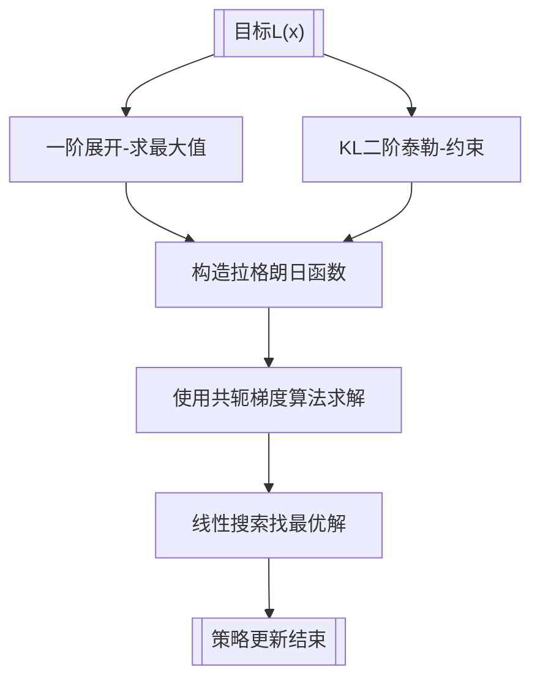

# 预备知识点

1. [拉格朗日乘子法](https://blog.csdn.net/qq00769539/article/details/163340267?spm=1011.2415.3001.5331)
2. [KL 散度](https://blog.csdn.net/qq00769539/article/details/163107459?spm=1011.2415.3001.5331)
3. [最优化理论](https://blog.csdn.net/qq00769539/article/details/163482078?spm=1011.2415.3001.5331)
   
   

# 广义优势估计GAE

## 蒙特卡洛优势 MC

$A_t^{MC}=G_t - V(s_t)$


## 单步 TD 优势

$A_t^{(1)} = \underbrace{ r_t + \gamma V(s_{t+1})}_{在训练中不等于G_t} - V(s_t)$


## GAE 数学公式

### 定义**TD 残差**

$\delta_t = r_t + \gamma V(s_{t+1}) - V(s_t)$

### 广义优势估计定义

$\boldsymbol{A_t^{GAE(\lambda)}=\sum_{l=0}^{\infty}(\gamma\lambda)^l \delta_{t+l}}$

$\lambda\in[0,1]$：GAE 权重系数

* $\lambda=0：A_t^{GAE}=A_t^{(1)}$ 单步 TD 优势
* $\lambda=1：A_t^{GAE}=A_t^{MC}$ 蒙特卡洛优势

### 示例

设定超参：

$\gamma=0.9,\quad \lambda=0.8$

| t   | r   | V   |
| --- | --- | --- |
| 0   | 1.0 | 4.0 |
| 1   | 1.0 | 3.0 |
| 2   | 1.0 | 2.0 |
| 3   | 1.0 | 1.0 |
| 4   | 0   | 0   |


#### 1. 计算各时刻 $\delta_t$

$\begin{cases}\delta_3 &= r_3 + \gamma V_4 - V_3 = 1.0 + 0.9\times 0 - 1.0 = \boldsymbol{0.0}\\\delta_2 &= r_2 + \gamma V_3 - V_2 = 1.0 + 0.9\times 1.0 - 2.0 = \boldsymbol{-0.1}\\\delta_1 &= r_1 + \gamma V_2 - V_1 = 1.0 + 0.9\times 2.0 - 3.0 = \boldsymbol{-0.2}\\\delta_0 &= r_0 + \gamma V_1 - V_0 = 1.0 + 0.9\times 3.0 - 4.0 = \boldsymbol{-0.3}\\\end{cases}$


#### 2.  $A_t^\text{GAE}$

$\begin{cases}A_3 &= \delta_3 = \boldsymbol{0.0}\\A_2 &= \delta_2 + 0.72\,A_3 = -0.1 + 0.72\times 0.0 = \boldsymbol{-0.1}\\A_1 &= \delta_1 + 0.72\,A_2 = -0.2 + 0.72\times(-0.1) = \boldsymbol{-0.272}\\A_0 &= \delta_0 + 0.72\,A_1 = -0.3 + 0.72\times(-0.272) = -0.3 - 0.19584 = \boldsymbol{-0.49584}\\\end{cases}$


# TRPO主要思想

在更新策略时找到一块**信任区域** ，在这个区域上更新策略时能够得到某种策略性能的安全性保证，在理论上能够保证策略学习的性能单调性，这就是**信任区域策略优化** 策略更新流程



# TRPO策略更新推导过程

## 1.原始定义

$\underbrace{\pi_{\boldsymbol{\theta}}(a|s)}_{动作概率分布}= \underbrace{\mathrm{softmax}\Big(w_2\, \max\big(w_1 s + b_1,\,0\big)+b_2\Big)}_{策略神经网络},\quad \boldsymbol{\theta}= \underbrace {\{w_1,b_1,w_2,b_2\}}_{网络参数}$


$\boldsymbol{L(\theta')=\mathbb{E}_{s\sim\rho_\theta,\,a\sim\pi_\theta}\left[\frac{\pi_{\theta'}(a|s)}{\pi_\theta(a|s)} \cdot A_\theta(s,a)\right]=mean \left[\frac{\pi_{\theta'}(a|s)}{\pi_\theta(a|s)} \cdot A_\theta(s,a)\right]}$

符号说明

* $\pi_\theta$：**旧策略，固定不动**
* $\pi_{\theta'}$：新策略，变量，我们优化 $\theta'$
* $A_\theta(s,a)$：**优势函数 Advantage**
* $\dfrac{\pi_{\theta'}(a|s)}{\pi_\theta(a|s)}$：重要性采样比率（probability ratio，PPO 里也用）
* 期望是用**旧策略采样出来的数据**，数据不重新采样

**最大化替代目标，同时约束新($\pi_{\theta'}$)旧($\pi_\theta$)策略 KL 散度不超过阈值**，避免策略一次性更新过大导致训练崩塌。


## 2.泰勒展开

令 $\theta'=\theta+\Delta\theta$，$\Delta\theta$ 是参数增量。

一阶泰勒：

$L(\theta+\Delta\theta)\approx \underbrace{L(\theta)}_{常量丢掉}+\underbrace{\nabla_{\theta}L(\theta)^\top}_{g=\nabla_{\theta}L(\theta)} \Delta\theta$


$L$**一阶展开** 优化简化为: $\max g^\top \Delta\theta$


## 3. $D_{KL}$ 散度

令 $\theta'=\theta+\Delta\theta$，$\Delta\theta$ 是参数增量，$\pi_{\theta}=\pi_{\theta}(a|s)$


$D_{KL}(\pi_{\theta}||\pi_{\theta'})=\sum \pi_{\boldsymbol{\theta}}(a|s)\log \pi_{\boldsymbol{\theta}}(a|s)- \sum \pi_{\boldsymbol{\theta}}(a|s)\log \pi_{\boldsymbol{\theta'}}(a|s)$


## 4.$D_{KL}$二阶泰勒展开：

$D_{KL}(\pi_{\theta}||\pi_{\theta'})={\sum \pi_{\boldsymbol{\theta}}(a|s)\log \pi_{\boldsymbol{\theta}}(a|s)}- \sum \pi_{\boldsymbol{\theta}}(a|s)\log \pi_{\boldsymbol{\theta'}}(a|s)$

$D_{KL}(\theta+\Delta\theta) \approx \underbrace{ D_{KL}(\theta)}_{项1} + \underbrace{\nabla_{\theta'} D_{KL}(\theta)^\top \Delta\theta}_{项2}+ \underbrace{\dfrac{1}{2}\Delta\theta^\top H \Delta\theta}_{项3}$


**项1 代入 $\theta'=\theta$：** 

$D_{KL}(\theta)={\sum \pi_{\boldsymbol{\theta}}(a|s)\log \pi_{\boldsymbol{\theta}}(a|s)}- \underbrace{\sum \pi_{\boldsymbol{\theta}}(a|s)\log \pi_{\boldsymbol{\theta'}}(a|s)}_{\theta'=\theta}=0$

**项2 代入 $\theta'=\theta$：**

$D_{KL}(\pi_{\theta}||\pi_{\theta'})=\underbrace{\sum \pi_{\boldsymbol{\theta}}(a|s)\log \pi_{\boldsymbol{\theta}}(a|s)}_{与\theta'无关，常数}- \sum \pi_{\boldsymbol{\theta}}(a|s)\log \pi_{\boldsymbol{\theta'}}(a|s)=-\sum \pi_{\boldsymbol{\theta}}(a|s)\log \pi_{\boldsymbol{\theta'}}(a|s)$

$\nabla_{\theta'}D_{KL}(\theta)=\nabla_{\theta'} D_{KL}(\theta)^\top \Delta\theta=-\sum \pi_{\boldsymbol{\theta}}(a|s) \nabla_{\theta'} \log \pi_{\boldsymbol{\theta'}}(a|s)=-\sum \underbrace{\pi_{\boldsymbol{\theta}}(a|s) \cdot \dfrac{1}{\pi_{\boldsymbol{\theta'}}(a|s)}}_{\theta'=\theta,这里等于1} \cdot \nabla_{\theta'} \pi_{\boldsymbol{\theta'}}(a|s)=-\sum \nabla_{\theta'} \pi_{\boldsymbol{\theta'}}(a|s)$

因为 策略是合法概率分布 $\sum \pi_{\theta}(a|s) = 1$ ，$\nabla_{\theta} \sum \pi_{\theta}(a|s)=0$

$\nabla_{\theta'}D_{KL}(\theta)=0$

**最终：**

$D_{KL}(\pi_{\theta}||\pi_{\theta'}) \approx \dfrac{1}{2}\Delta\theta^\top H \Delta\theta$


## 5.TRPO目标约束

$\begin{cases} 
\max g^\top \Delta\theta \\
s.t.\quad D_{KL}(\pi_{\theta}||\pi_{\theta'}) \approx \dfrac{1}{2}\Delta\theta^\top H \Delta\theta \le \delta 
\end{cases}$

$\boldsymbol{\delta}：$ **KL 散度最大允许上界（超参数）**，人为设定的常数。


## 6.拉格朗日乘子法(KKT)

$\begin{cases} \max g^\top \Delta\theta \\s.t.\quad  \dfrac{1}{2}\Delta\theta^\top H \Delta\theta \le \delta \end{cases}$


  令 $x=\Delta\theta$

**不等式约束:**

 $h(\boldsymbol x)=\dfrac12\boldsymbol x^\top H\boldsymbol x-\delta \le 0$

$\begin{cases} \max g^\top \boldsymbol x == {\color{red} {-}} \min g^\top \boldsymbol x \\s.t.\quad h(\boldsymbol x)=\dfrac12\boldsymbol x^\top H\boldsymbol x-\delta \le 0 \end{cases}$


**构造拉格朗日函数**

$\mathcal L(\boldsymbol x,\lambda)= \boldsymbol g^\top \boldsymbol x {\color{red}{-}} \lambda\left(\frac12\boldsymbol x^\top H\boldsymbol x-\delta\right)$

$\lambda\ge 0$ 是拉格朗日乘子。


### KKT 条件

$\begin{cases}
 驻点条件: \nabla_{x}\mathcal L =  \nabla_{x} g^\top x- \nabla_{x}\lambda\left(\frac12 x^\top H x-\delta\right)=g- \lambda Hx=0\\
 原可行性: \frac12 x^\top H x \le \delta\\
 对偶可行性: \lambda \ge 0\\
 互补松弛: \lambda\left(\frac12 x^\top H x-\delta\right)=0
\end{cases}$

$\textcircled{1}求解\lambda= \begin{cases}g- \lambda Hx=0 \quad \Rightarrow\ x=\frac{1}{\lambda}  H^{-1} g \quad 待解出\lambda后算出x\\
\frac12 x^\top H x-\delta=0 \quad \Rightarrow  x^\top Hx=2\delta \Rightarrow\ \underbrace{(\frac{1}{\lambda} H^{-1}g)^\top H (\frac{1}{\lambda} H^{-1}g)=2\delta}_{可以解出\lambda}\\
 解过程1：\dfrac{1}{\lambda^2} g^\top H^{-1} \underbrace {H H^{-1}}_{HH^{-1}=I}g=2\delta\\\\
 解过程2: g^\top H^{-1}g =2\delta  \lambda^2 \Rightarrow\ \dfrac{g^\top H^{-1}g}{2\delta}=\lambda^2\\\\
 \lambda=\sqrt{\dfrac{g^\top H^{-1}g}{2\delta}}
\end{cases}$

$\textcircled{2}求解 x= \begin{cases}\\  \lambda=\sqrt{\dfrac{g^\top H^{-1}g}{2\delta}}\\\\
x=\frac{1}{\lambda} H^{-1}g = \dfrac{H^{-1}g}{\sqrt{\dfrac{g^\top H^{-1}g}{2\delta}}}\quad 根号分式：\sqrt{\dfrac{A}{B}}=\dfrac{\sqrt A}{\sqrt B}\\\\
x=\sqrt{\dfrac{2\delta}{g^\top H^{-1}g}} \cdot H^{-1}g
\end{cases}$


$\textcircled{3}=\begin{cases}\\  x=\Delta\theta=\sqrt{\dfrac{2\delta}{g^\top H^{-1}g}} \cdot H^{-1}g \\\\  \end{cases}$

## 7.共轭梯度算法

$x=\Delta\theta=\sqrt{\dfrac{2\delta}{g^\top H^{-1}g}} \cdot H^{-1}g \quad 令 \ z=H^{-1}g \ 则 \ Hz=H H^{-1}g \Rightarrow Hz=g$ 

通过$Hz=g$方程式 解出$z$:

1. 海森矩阵–向量乘积 (HVP) $\quad Hd_k=HVP(d_k)$
2. 初始化 $z_0=0,r_0=g,d_0=g$
3. 迭代循环(最大次数$k=10$)
4. $\quad Hd_k=HVP(d_k)$
5. $\quad a_k=\dfrac{r_k^\top r_k}{d_k^\top Hd_k}$
6. $\quad z_{k+1}=z_k+a_kd_k$
7. $\quad r_{k+1}=r_k-a_kHd_k$
8. $\quad if (\|r_{k+1}\|^2 < \epsilon): 结束$
9. $\quad \beta_k=\dfrac{r_{k+1}^\top r_{k+1}}{ r_{k}^\top r_{k} }$
10. $\quad d_{k+1}=r_{k+1}+\beta_k d_{k}$
11. 迭代结束得到$z \approx H^{-1}g$

## 8.线性搜索(回溯线搜索)

$\Delta\theta=\sqrt{\dfrac{2\delta}{g^\top H^{-1}g}} \cdot H^{-1}g= \sqrt{\dfrac{2\delta}{g^\top z}} \cdot z$


$\begin{cases}
 i<15 
\\ \theta_{k+i}=\theta+\alpha^i\cdot \Delta\theta_{}
\\ \boldsymbol{L(\theta_{k+i})  \ge \boldsymbol{L(\theta)}\ \&\& \ D_{KL} < \delta} 结束 \ \ 输出 \  \theta_{k+i}
\\ i++
\end{cases}$


# TRPO策略更新实现代码

## 0. Actor 和 Critic 网络


TRPO 使用两个神经网络：


```

PolicyNet m_ActorNet;

ValueNet m_CriticNet;

```


Actor 使用 `PolicyNet`，输入状态，经过 `softmax` 输出所有离散动作的概率：


$\pi_\theta(\cdot|s)=[P(a_0|s),P(a_1|s),\ldots]$


Critic 使用 `ValueNet`，输入状态并输出一个标量状态价值：


$V_\omega(s)$


Actor 不使用普通 Adam 优化器，而是通过共轭梯度和回溯线搜索更新参数。Critic 仍然使用 Adam 优化器最小化价值损失。


## 1. 创建网络和 Critic 优化器


```

void TRPO::GenerateTrainData(int maxCount)

{

    cout << "Currently TRPO" << endl;


    m_dbGamma = 0.98;

    m_dbAlpha = 0.5;


    auto input = m_objEnv->GetStateDim();

    auto output = m_objEnv->GetActionDim();


    m_ActorNet = PolicyNet(input, output);

    m_CriticNet = ValueNet(input, 1);


    m_CriticNet->to(m_device);

    m_ActorNet->to(m_device);


    m_pAdamCritic = new torch::optim::Adam(

        m_CriticNet->parameters(), { m_dbCriticLR });


    m_ActorNet->train();

    m_CriticNet->train();


    BaseAdvanced::GenerateTrainData(maxCount);


    m_ActorNet->eval();

    m_CriticNet->eval();


    delete m_pAdamCritic;

    m_pAdamCritic = nullptr;

}

```


主要超参数为：


- 折扣因子 `m_dbGamma = 0.98`；

- GAE 参数 `m_dbLmbda = 0.95`；

- Critic 学习率 `m_dbCriticLR = 1e-2`；

- KL 约束 `m_dbklConstraint = 5e-4`；

- 回溯线搜索系数 `m_dbAlpha = 0.5`。
  
  

## 2. 根据 Actor 选择动作


```

double TRPO::TakeAction(VectorDouble& s0, bool bPredict)

{

    torch::NoGradGuard no_grad;

    auto s = VectorDoubleTensor(s0, m_device);

    auto logits = m_ActorNet->forward(s);

    torch::Tensor action;


    if (bPredict)

    {

        action = logits.argmax(-1);

    }

    else

    {

        Categorical categorical(logits);

        action = categorical.sample();

    }


    return action.item<int>();

}

```


训练时按照 Actor 输出的类别分布采样动作，评测时选择概率最大的动作。TRPO 属于同策略（On-Policy）算法，当前回合数据由更新前的旧策略生成，并在策略更新时立即使用。


## 3. 更新 Critic


```

auto [s0, a, r, s1, done] = QwListToTensor(vList, m_device);


auto v0 = m_CriticNet->forward(s0);

auto v1 = r + m_dbGamma * m_CriticNet->forward(s1) * (1 - done);

auto td = v1 - v0;


auto criticLoss = torch::mean(torch::mse_loss(v0, v1.detach()));

m_pAdamCritic->zero_grad();

criticLoss.backward();

m_pAdamCritic->step();

```


Critic 的 TD 目标为：


$y_t=r_t+\gamma V_\omega(s_{t+1})(1-done_t)$


Critic 损失为：


$\mathcal L_{Critic}=\operatorname{MSE}(V_\omega(s_t),y_t)$


`v1.detach()` 将 TD 目标作为固定标签，避免梯度通过下一状态价值传播。变量 `td` 保存 Critic 更新前计算的 TD 误差，后续用于计算 GAE 优势。


## 4. 计算 GAE


```

torch::Tensor TRPO::ComputeAdvantage(

    double gamma, double lmbda, torch::Tensor& td)

{

    auto device = td.device();

    td.detach_();

    td = td.cpu().contiguous();


    auto n = td.size(0);

    auto m = td.size(1);

    std::vector<float> advantages(static_cast<size_t>(n * m));


    for (int64_t col = 0; col < m; ++col)

    {

        double adv = 0.0;

        for (int64_t i = n - 1; i >= 0; --i)

        {

            double delta = (m == 1)

                ? td[i].item<double>()

                : td[i][col].item<double>();

            adv = gamma * lmbda * adv + delta;

            advantages[static_cast<size_t>(i * m + col)]

                = static_cast<float>(adv);

        }

    }


    auto options = torch::TensorOptions().dtype(torch::kFloat32);

    auto adv = torch::from_blob(

        advantages.data(), { n, m }, options).clone();

    return adv.to(device);

}

```


代码从轨迹末尾向前执行：


$adv\leftarrow\delta_t+\gamma\lambda adv$


`td.detach_()` 切断 TD 误差与 Critic 计算图的联系，因为优势值只作为更新 Actor 的固定权重。


计算过程放在 CPU 上完成，最终再把优势张量移动回原来的设备。


## 5. 优势归一化


```

auto adv = ComputeAdvantage(m_dbGamma, m_dbLmbda, td);


auto mean = adv.mean();

auto std = adv.std();

auto adv_norm = (adv - mean) / (std + 1e-8);

```


优势归一化公式为：


$\hat A_t=\frac{A_t-\operatorname{mean}(A)}{\operatorname{std}(A)+10^{-8}}$


归一化不会改变动作优势的相对大小，可以减少不同回合奖励尺度变化对策略更新的影响。分母加 $10^{-8}$ 用于防止标准差为 $0$ 时除零。


## 6. 保存旧策略信息


```

auto logProbs = torch::log(

    m_ActorNet->forward(s0).gather(1, a)).detach();

auto actionDists = Categorical(

    m_ActorNet->forward(s0).detach());

```


在更新 Actor 前，需要保存旧策略：


- `logProbs`：旧策略对轨迹实际动作的对数概率；

- `actionDists`：旧策略在每个状态下的完整动作分布。
  
  

实际动作的旧概率用于计算重要性采样比率，完整旧分布用于计算新旧策略之间的 KL 散度。调用 `detach()` 后，这些数据不会随着 Actor 参数更新而变化。


## 7. 计算代理目标


```

torch::Tensor TRPO::ComputeSurrogateObj(

    const torch::Tensor& s,

    const torch::Tensor& a,

    const torch::Tensor& adv,

    const torch::Tensor& oldLogProbs,

    PolicyNet& actorNet)

{

    auto probs = actorNet->forward(s).gather(1, a);

    auto logProbs = torch::log(probs);

    auto ratio = torch::exp(logProbs - oldLogProbs);

    return (ratio * adv).mean();

}

```


对应公式：


$r_t(\theta)=\exp\left(\log\pi_\theta(a_t|s_t)-\log\pi_{old}(a_t|s_t)\right)$


$L(\theta)=\operatorname{mean}\left(r_t(\theta)\hat A_t\right)$


TRPO 的目标是最大化代理目标，因此后续沿其梯度方向更新，而不是像常规损失函数一样执行梯度下降。


## 8. Hessian 向量积


```

auto newDists = Categorical(m_ActorNet->forward(s));

auto kl = torch::mean(oldsDists.kl_divergence(newDists));


auto grads = torch::autograd::grad(

    { kl }, params, {}, true, true, true);

auto vectorGrad = torch::cat(flatGradParts);

auto klGradVectorProduct = torch::dot(vectorGrad, v);

auto grad2 = torch::autograd::grad(

    { klGradVectorProduct }, params, {}, true, false, true);

auto Hv = torch::cat(flat2Parts);


constexpr double damping = 0.1;

return Hv + damping * v;

```


首先对平均 KL 散度求一次梯度，并保留计算图；然后将 KL 梯度与向量 $v$ 做内积，再对结果求一次梯度，得到：


$Hv=\nabla_\theta\left((\nabla_\theta D_{KL})^Tv\right)$


这种方法不需要显式构造大小为“参数量 × 参数量”的 Hessian 矩阵。


返回结果中加入阻尼项：


$Hv\leftarrow Hv+0.1v$


阻尼能够改善数值稳定性，避免 Hessian 接近奇异时共轭梯度求解发生剧烈波动。


## 9. 共轭梯度法


```

torch::Tensor TRPO::ConjugateGradient(

    const torch::Tensor& objGrad,

    const torch::Tensor& s,

    const Categorical& oldsDists)

{

    auto x = torch::zeros_like(objGrad);

    auto r = objGrad.clone();

    auto p = r.clone();

    auto rdotr = torch::dot(r, r);


    for (int i = 0; i < 20; i++)

    {

        auto Hp = HessianMatrixVectorProduct(s, oldsDists, p);

        auto alpha = rdotr / torch::dot(p, Hp);

        x += alpha * p;

        r -= alpha * Hp;

        auto new_rdotr = torch::dot(r, r);


        if (new_rdotr.item<double>() < 1e-9)

        {

            break;

        }


        auto beta = new_rdotr / rdotr;

        p = r + beta * p;

        rdotr = new_rdotr;

    }


    return x;

}

```


共轭梯度法用于近似求解线性方程：


$Hx=g$


返回的 $x$ 近似为：


$x\approx H^{-1}g$


本实现最多迭代 20 次。当残差平方小于 $10^{-9}$ 时提前停止。


## 10. 计算完整更新步长


```

auto surrogateObj = ComputeSurrogateObj(

    s, a, adv, oldLogProbs, m_ActorNet);

auto grads = torch::autograd::grad(

    { surrogateObj }, m_ActorNet->parameters());


auto flatGrad = torch::cat(flat);

auto searchDirection = ConjugateGradient(

    flatGrad, s, oldsDists);

auto Hd = HessianMatrixVectorProduct(

    s, oldsDists, searchDirection);

auto stepScale = torch::sqrt(

    2 * m_dbklConstraint /

    torch::dot(searchDirection, Hd));

auto fullStep = (stepScale * searchDirection).detach();

```


首先计算代理目标梯度 $g$，然后使用共轭梯度法得到搜索方向：


$d\approx H^{-1}g$


再按照 KL 约束缩放搜索方向：


$fullStep=\sqrt{\frac{2\delta}{d^THd}}d$


`fullStep` 是二阶近似下能够满足 KL 约束的最大更新步长，但由于神经网络是非线性的，实际更新后仍可能违反 KL 约束，因此还需要回溯线搜索。


## 11. 回溯线搜索


```

for (int i = 0; i < 15; i++)

{

    auto coefficient = std::pow(m_dbAlpha, i);

    auto newParams = oldParam + coefficient * fullStep;


    VectorToParameters(newParams, *tmpActor);


    auto newActionDists = Categorical(tmpActor->forward(s));

    auto kl = torch::mean(

        oldsDists.kl_divergence(newActionDists));

    auto newSurrogate = ComputeSurrogateObj(

        s, a, adv, oldLogProbs, tmpActor);


    if (newSurrogate.item<double>() >

            oldSurrogate.item<double>() &&

        kl.item<double>() < m_dbklConstraint)

    {

        bUpdate = true;

        return newParams.detach();

    }

}

```


第 $i$ 次尝试的参数为：


$\theta_{new}=\theta_{old}+\alpha^i fullStep$


本实现中 $\alpha=0.5$，最多尝试 15 次。候选参数必须同时满足两个条件：


1. 新代理目标大于旧代理目标；

2. 新旧策略平均 KL 散度小于 `m_dbklConstraint`。
   
   

如果完整步长不满足条件，就依次尝试 $0.5$、$0.25$、$0.125$ 倍步长。如果所有候选参数都不满足条件，则保留旧参数，不执行本次 Actor 更新。


使用临时策略网络 `tmpActor` 测试候选参数，可以避免在确认步长有效之前修改正式 Actor。


## 12. 完整 Actor 更新


```

bool bUpdate;

auto newParams = LineSearch(

    s, a, adv, oldLogProbs, oldsDists,

    fullStep, bUpdate);


if (bUpdate)

{

    VectorToParameters(newParams, *m_ActorNet);

}

```


TRPO 的 Actor 更新流程为：


1. 计算代理目标梯度 $g$；

2. 使用 Hessian 向量积表示 KL 曲率；

3. 使用共轭梯度法近似计算 $H^{-1}g$；

4. 根据 KL 上限计算完整步长；

5. 使用回溯线搜索检查代理目标和真实 KL 散度；

6. 找到合格参数后更新 Actor，否则放弃本次更新。
   
   

## 13. 训练终止条件


```

static int count = 0;


if (450 < vList.size())

{

    count++;

    if (3 < count)

    {

        m_bEndGenerateTrain = true;

        return;

    }

}

else

{

    count = 0;

}

```


当单回合步数超过 450 时，`count` 加 $1$；如果下一回合未达标，`count` 清零。连续 4 个回合超过 450 后结束训练。


**训练终止条件：** 达到最大迭代次数，或连续 4 个回合的步数超过 450。


# TRPO现状

- **极少落地，多用于仿真预研**

- **TRPO 是理论上漂亮的原型，证明了信赖域约束能稳定策略更新；工业上没人直接跑原生 TRPO，但它的核心思想被 PPO 继承，PPO 成为工业强化学习的事实标准。**


