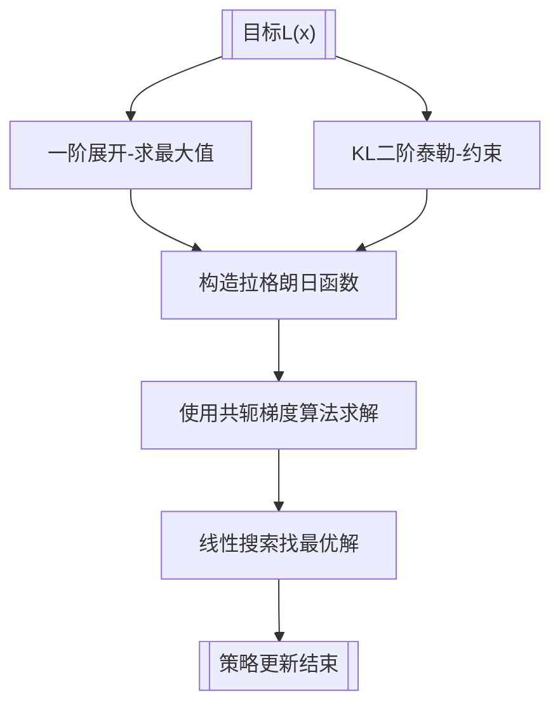

# 广义优势估计GAE

## 蒙特卡洛优势 MC

$A_t^{MC}=G_t - V(s_t)$

## 单步 TD 优势

$A_t^{(1)} = \underbrace{ r_t + \gamma V(s_{t+1})}_{在训练中不等于G_t} - V(s_t)$

## GAE 数学公式

### 定义**TD 残差**

$\delta_t = r_t + \gamma V(s_{t+1}) - V(s_t)$

### 广义优势估计定义

$\boldsymbol{A_t^{GAE(\lambda)}=\sum_{l=0}^{\infty}(\gamma\lambda)^l \delta_{t+l}}$

$\lambda\in[0,1]$：GAE 权重系数

* $\lambda=0：A_t^{GAE}=A_t^{(1)}$ 单步 TD 优势
* $\lambda=1：A_t^{GAE}=A_t^{MC}$ 蒙特卡洛优势

### 示例

设定超参：

$\gamma=0.9,\quad \lambda=0.8$

| t   | r   | V   |
| --- | --- | --- |
| 0   | 1.0 | 4.0 |
| 1   | 1.0 | 3.0 |
| 2   | 1.0 | 2.0 |
| 3   | 1.0 | 1.0 |
| 4   | 0   | 0   |

#### 1. 计算各时刻 $\delta_t$

$\begin{cases}\delta_3 &= r_3 + \gamma V_4 - V_3 = 1.0 + 0.9\times 0 - 1.0 = \boldsymbol{0.0}\\\delta_2 &= r_2 + \gamma V_3 - V_2 = 1.0 + 0.9\times 1.0 - 2.0 = \boldsymbol{-0.1}\\\delta_1 &= r_1 + \gamma V_2 - V_1 = 1.0 + 0.9\times 2.0 - 3.0 = \boldsymbol{-0.2}\\\delta_0 &= r_0 + \gamma V_1 - V_0 = 1.0 + 0.9\times 3.0 - 4.0 = \boldsymbol{-0.3}\\\end{cases}$

#### 2.  $A_t^\text{GAE}$

$\begin{cases}A_3 &= \delta_3 = \boldsymbol{0.0}\\A_2 &= \delta_2 + 0.72\,A_3 = -0.1 + 0.72\times 0.0 = \boldsymbol{-0.1}\\A_1 &= \delta_1 + 0.72\,A_2 = -0.2 + 0.72\times(-0.1) = \boldsymbol{-0.272}\\A_0 &= \delta_0 + 0.72\,A_1 = -0.3 + 0.72\times(-0.272) = -0.3 - 0.19584 = \boldsymbol{-0.49584}\\\end{cases}$

# TRPO主要思想

在更新策略时找到一块**信任区域** ，在这个区域上更新策略时能够得到某种策略性能的安全性保证，在理论上能够保证策略学习的性能单调性，这就是**信任区域策略优化** 策略更新流程

# TRPO策略更新推导过程

## 1.原始定义

$\underbrace{\pi_{\boldsymbol{\theta}}(a|s)}_{动作概率分布}= \underbrace{\mathrm{softmax}\Big(w_2\, \max\big(w_1 s + b_1,\,0\big)+b_2\Big)}_{策略神经网络},\quad \boldsymbol{\theta}= \underbrace {\{w_1,b_1,w_2,b_2\}}_{网络参数}$

$\boldsymbol{L(\theta')=\mathbb{E}_{s\sim\rho_\theta,\,a\sim\pi_\theta}\left[\frac{\pi_{\theta'}(a|s)}{\pi_\theta(a|s)} \cdot A_\theta(s,a)\right]=mean \left[\frac{\pi_{\theta'}(a|s)}{\pi_\theta(a|s)} \cdot A_\theta(s,a)\right]}$

符号说明

* $\pi_\theta$：**旧策略，固定不动**
* $\pi_{\theta'}$：新策略，变量，我们优化 $\theta'$
* $A_\theta(s,a)$：**优势函数 Advantage**
* $\dfrac{\pi_{\theta'}(a|s)}{\pi_\theta(a|s)}$：重要性采样比率（probability ratio，PPO 里也用）
* 期望是用**旧策略采样出来的数据**，数据不重新采样

**最大化替代目标，同时约束新($\pi_{\theta'}$)旧($\pi_\theta$)策略 KL 散度不超过阈值**，避免策略一次性更新过大导致训练崩塌。

## 2.泰勒展开

令 $\theta'=\theta+\Delta\theta$，$\Delta\theta$ 是参数增量。

一阶泰勒：

$L(\theta+\Delta\theta)\approx \underbrace{L(\theta)}_{常量丢掉}+\underbrace{\nabla_{\theta}L(\theta)^\top}_{g=\nabla_{\theta}L(\theta)} \Delta\theta$

$L$**一阶展开** 优化简化为: $\max g^\top \Delta\theta$

## 3. $D_{KL}$ 散度

令 $\theta'=\theta+\Delta\theta$，$\Delta\theta$ 是参数增量，$\pi_{\theta}=\pi_{\theta}(a|s)$

$D_{KL}(\pi_{\theta}||\pi_{\theta'})=\sum \pi_{\boldsymbol{\theta}}(a|s)\log \pi_{\boldsymbol{\theta}}(a|s)- \sum \pi_{\boldsymbol{\theta}}(a|s)\log \pi_{\boldsymbol{\theta'}}(a|s)$

## 4.$D_{KL}$二阶泰勒展开：

$D_{KL}(\pi_{\theta}||\pi_{\theta'})={\sum \pi_{\boldsymbol{\theta}}(a|s)\log \pi_{\boldsymbol{\theta}}(a|s)}- \sum \pi_{\boldsymbol{\theta}}(a|s)\log \pi_{\boldsymbol{\theta'}}(a|s)$

$D_{KL}(\theta+\Delta\theta) \approx \underbrace{ D_{KL}(\theta)}_{项1} + \underbrace{\nabla_{\theta'} D_{KL}(\theta)^\top \Delta\theta}_{项2}+ \underbrace{\dfrac{1}{2}\Delta\theta^\top H \Delta\theta}_{项3}$

**项1 代入 $\theta'=\theta$：** 

$D_{KL}(\theta)={\sum \pi_{\boldsymbol{\theta}}(a|s)\log \pi_{\boldsymbol{\theta}}(a|s)}- \underbrace{\sum \pi_{\boldsymbol{\theta}}(a|s)\log \pi_{\boldsymbol{\theta'}}(a|s)}_{\theta'=\theta}=0$

**项2 代入 $\theta'=\theta$：**

$D_{KL}(\pi_{\theta}||\pi_{\theta'})=\underbrace{\sum \pi_{\boldsymbol{\theta}}(a|s)\log \pi_{\boldsymbol{\theta}}(a|s)}_{与\theta'无关，常数}- \sum \pi_{\boldsymbol{\theta}}(a|s)\log \pi_{\boldsymbol{\theta'}}(a|s)=-\sum \pi_{\boldsymbol{\theta}}(a|s)\log \pi_{\boldsymbol{\theta'}}(a|s)$

$\nabla_{\theta'}D_{KL}(\theta)=\nabla_{\theta'} D_{KL}(\theta)^\top \Delta\theta=-\sum \pi_{\boldsymbol{\theta}}(a|s) \nabla_{\theta'} \log \pi_{\boldsymbol{\theta'}}(a|s)=-\sum \underbrace{\pi_{\boldsymbol{\theta}}(a|s) \cdot \dfrac{1}{\pi_{\boldsymbol{\theta'}}(a|s)}}_{\theta'=\theta,这里等于1} \cdot \nabla_{\theta'} \pi_{\boldsymbol{\theta'}}(a|s)=-\sum \nabla_{\theta'} \pi_{\boldsymbol{\theta'}}(a|s)$

因为 策略是合法概率分布 $\sum \pi_{\theta}(a|s) = 1$ ，$\nabla_{\theta} \sum \pi_{\theta}(a|s)=0$

$\nabla_{\theta'}D_{KL}(\theta)=0$

**最终：**

$D_{KL}(\pi_{\theta}||\pi_{\theta'}) \approx \dfrac{1}{2}\Delta\theta^\top H \Delta\theta$

## 5.TRPO目标约束

$\begin{cases} 
\max g^\top \Delta\theta \\
s.t.\quad D_{KL}(\pi_{\theta}||\pi_{\theta'}) \approx \dfrac{1}{2}\Delta\theta^\top H \Delta\theta \le \delta 
\end{cases}$

$\boldsymbol{\delta}：$ **KL 散度最大允许上界（超参数）**，人为设定的常数。

## 6.拉格朗日乘子法(KKT)

$\begin{cases} \max g^\top \Delta\theta \\s.t.\quad  \dfrac{1}{2}\Delta\theta^\top H \Delta\theta \le \delta \end{cases}$

  令 $x=\Delta\theta$

**不等式约束:**

 $h(\boldsymbol x)=\dfrac12\boldsymbol x^\top H\boldsymbol x-\delta \le 0$

$\begin{cases} \max g^\top \boldsymbol x == {\color{red} {-}} \min g^\top \boldsymbol x \\s.t.\quad h(\boldsymbol x)=\dfrac12\boldsymbol x^\top H\boldsymbol x-\delta \le 0 \end{cases}$

**构造拉格朗日函数**

$\mathcal L(\boldsymbol x,\lambda)= \boldsymbol g^\top \boldsymbol x {\color{red}{-}} \lambda\left(\frac12\boldsymbol x^\top H\boldsymbol x-\delta\right)$

$\lambda\ge 0$ 是拉格朗日乘子。

### KKT 条件

$\begin{cases}
 驻点条件: \nabla_{x}\mathcal L =  \nabla_{x} g^\top x- \nabla_{x}\lambda\left(\frac12 x^\top H x-\delta\right)=g- \lambda Hx=0\\
 原可行性: \frac12 x^\top H x \le \delta\\
 对偶可行性: \lambda \ge 0\\
 互补松弛: \lambda\left(\frac12 x^\top H x-\delta\right)=0
\end{cases}$

$\textcircled{1}求解\lambda= \begin{cases}g- \lambda Hx=0 \quad \Rightarrow\ x=\frac{1}{\lambda}  H^{-1} g \quad 待解出\lambda后算出x\\
\frac12 x^\top H x-\delta=0 \quad \Rightarrow  x^\top Hx=2\delta \Rightarrow\ \underbrace{(\frac{1}{\lambda} H^{-1}g)^\top H (\frac{1}{\lambda} H^{-1}g)=2\delta}_{可以解出\lambda}\\
 解过程1：\dfrac{1}{\lambda^2} g^\top H^{-1} \underbrace {H H^{-1}}_{HH^{-1}=I}g=2\delta\\\\
 解过程2: g^\top H^{-1}g =2\delta  \lambda^2 \Rightarrow\ \dfrac{g^\top H^{-1}g}{2\delta}=\lambda^2\\\\
 \lambda=\sqrt{\dfrac{g^\top H^{-1}g}{2\delta}}
\end{cases}$

$\textcircled{2}求解 x= \begin{cases}\\  \lambda=\sqrt{\dfrac{g^\top H^{-1}g}{2\delta}}\\\\
x=\frac{1}{\lambda} H^{-1}g = \dfrac{H^{-1}g}{\sqrt{\dfrac{g^\top H^{-1}g}{2\delta}}}\quad 根号分式：\sqrt{\dfrac{A}{B}}=\dfrac{\sqrt A}{\sqrt B}\\\\
x=\sqrt{\dfrac{2\delta}{g^\top H^{-1}g}} \cdot H^{-1}g
\end{cases}$

$\textcircled{3}=\begin{cases}\\  x=\Delta\theta=\sqrt{\dfrac{2\delta}{g^\top H^{-1}g}} \cdot H^{-1}g \\\\  \end{cases}$

## 7.共轭梯度算法

$x=\Delta\theta=\sqrt{\dfrac{2\delta}{g^\top H^{-1}g}} \cdot H^{-1}g \quad 令 \ z=H^{-1}g \ 则 \ Hz=H H^{-1}g \Rightarrow Hz=g$ 

通过$Hz=g$方程式 解出$z$:

1. 海森矩阵–向量乘积 (HVP) $\quad Hd_k=HVP(d_k)$
2. 初始化 $z_0=0,r_0=g,d_0=g$
3. 迭代循环(最大次数$k=10$)
4. $\quad Hd_k=HVP(d_k)$
5. $\quad a_k=\dfrac{r_k^\top r_k}{d_k^\top Hd_k}$
6. $\quad z_{k+1}=z_k+a_kd_k$
7. $\quad r_{k+1}=r_k-a_kHd_k$
8. $\quad if (\|r_{k+1}\|^2 < \epsilon): 结束$
9. $\quad \beta_k=\dfrac{r_{k+1}^\top r_{k+1}}{ r_{k}^\top r_{k} }$
10. $\quad d_{k+1}=r_{k+1}+\beta_k d_{k}$
11. 迭代结束得到$z \approx H^{-1}g$

## 8.线性搜索(回溯线搜索)

$\Delta\theta=\sqrt{\dfrac{2\delta}{g^\top H^{-1}g}} \cdot H^{-1}g= \sqrt{\dfrac{2\delta}{g^\top z}} \cdot z$

$\begin{cases}
 i<15 
\\ \theta_{k+i}=\theta+\alpha^i\cdot \Delta\theta_{}
\\ \boldsymbol{L(\theta_{k+i})  \ge \boldsymbol{L(\theta)}\ \&\& \ D_{KL} < \delta} 结束 \ \ 输出 \  \theta_{k+i}
\\ i++
\end{cases}$

# TRPO策略更新实现代码

