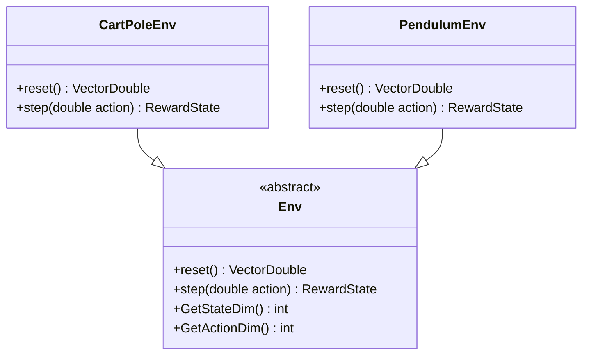
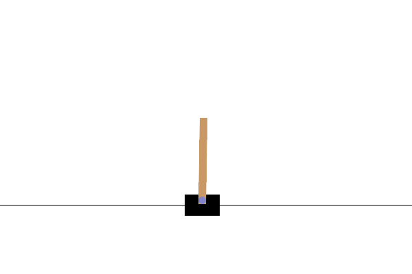
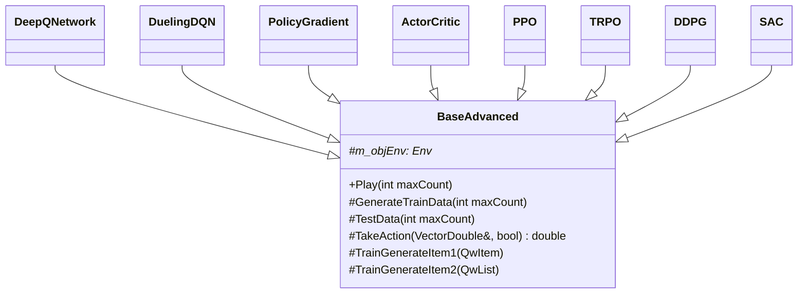
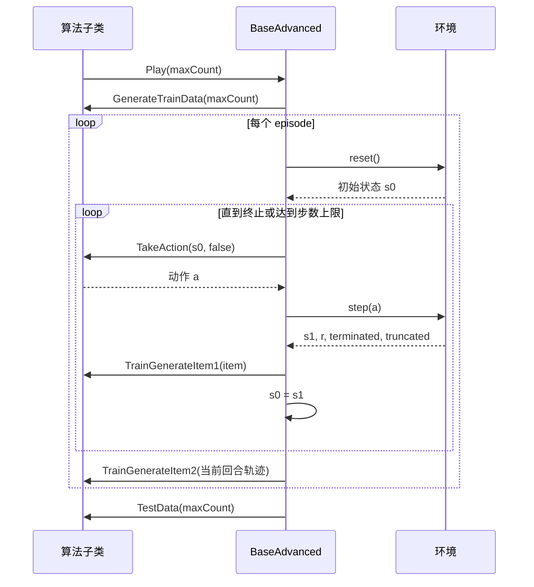

# 强化学习进阶：从环境交互到 DQN、PPO 与 SAC 的 C++ 实现

强化学习（Reinforcement Learning，RL）研究的是：**智能体如何通过不断试错，在环境中获得更高的长期奖励**。

本项目基于 C++20 和 libtorch（PyTorch C++ API）实现了多个经典强化学习算法，提供 CartPole 离散动作环境与 Pendulum 连续动作环境，并通过统一的训练框架组织算法代码。

> 项目目录：`AdvancedChapterRL`  
> 构建工具：CMake + Ninja  
> 语言标准：C++20  
> 深度学习库：libtorch

---

## 1. 学习路线

| 算法           | 动作类型 | 环境       | 难度    | 学习重点                   |
|:------------ |:----:|:-------- |:-----:|:---------------------- |
| DQN          | 离散   | CartPole | ⭐⭐    | Q 值、经验回放、目标网络          |
| Double DQN   | 离散   | CartPole | ⭐⭐    | 缓解 Q 值高估               |
| Dueling DQN  | 离散   | CartPole | ⭐⭐    | Value/Advantage 网络结构   |
| REINFORCE    | 离散   | CartPole | ⭐⭐⭐   | 蒙特卡洛策略梯度               |
| Actor-Critic | 离散   | CartPole | ⭐⭐⭐   | 策略网络与价值网络协作            |
| PPO          | 离散   | CartPole | ⭐⭐⭐   | GAE、裁剪目标函数             |
| TRPO         | 离散   | CartPole | ⭐⭐⭐⭐⭐ | KL 约束、共轭梯度、线搜索         |
| DDPG         | 连续   | Pendulum | ⭐⭐⭐⭐  | 连续动作、Actor-Critic、目标网络 |
| SAC          | 连续   | Pendulum | ⭐⭐⭐⭐  | 双 Q 网络、熵正则化、自适应温度      |

建议依次学习 DQN、Double DQN、策略梯度、Actor-Critic、PPO，最后再学习 TRPO、DDPG 与 SAC。

---

## 2. 强化学习如何与环境交互

强化学习中的一次交互过程如下：

```text
状态 s
  ↓
智能体选择动作 a
  ↓
环境执行 step(a)
  ↓
得到奖励 r、下一状态 s1、是否结束 done
```

项目将一次经验保存为：

```text
(state, action, reward, nextState, done)
```

对应 `QwItem`：

| 字段     | 类型             | 含义       |
|:------ |:-------------- |:-------- |
| `s0`   | `VectorDouble` | 当前状态     |
| `a`    | `double`       | 当前动作     |
| `r`    | `double`       | 即时奖励     |
| `s1`   | `VectorDouble` | 下一状态     |
| `done` | `bool`         | 当前回合是否结束 |

强化学习希望最大化长期累计奖励：

$$
G_t = r_t + \gamma r_{t+1} + \gamma^2 r_{t+2} + \cdots
$$

其中 $\gamma$ 是折扣因子。它越接近 `1`，智能体越重视未来奖励。

---

## 3. 环境实现

项目定义了 `Env` 抽象类，`CartPoleEnv` 和 `PendulumEnv` 分别实现离散与连续控制环境。



### 3.1 CartPole：连续状态、离散动作



CartPole 的目标是通过控制小车左右移动，使杆尽可能保持竖直。

状态为 4 维连续向量：

| 下标  | 状态          | 含义     |
|:---:|:----------- |:------ |
| 0   | `x`         | 小车水平位置 |
| 1   | `x_dot`     | 小车速度   |
| 2   | `theta`     | 杆的角度   |
| 3   | `theta_dot` | 杆的角速度  |

动作空间为：

| 动作值 | 行为    |
|:---:|:----- |
| `0` | 向左施加力 |
| `1` | 向右施加力 |

当前实现中，小车位置超出 `[-2.4, 2.4]`，或杆角度超过约 `±12°` 时回合终止。未终止时奖励为 `1`，终止时奖励为 `0`。

### 3.2 Pendulum：连续状态、连续动作


Pendulum 的目标是控制摆杆稳定在竖直向上的位置。

状态为：

| 下标  | 状态           | 范围        |
|:---:|:------------ |:--------- |
| 0   | `cos(theta)` | `[-1, 1]` |
| 1   | `sin(theta)` | `[-1, 1]` |
| 2   | `theta_dot`  | `[-8, 8]` |

动作是连续力矩，范围为 `[-2.0, 2.0]`。

奖励函数为：

$$
r = -(\theta^2 + 0.1\dot{\theta}^2 + 0.001u^2)
$$

其中 $u$ 是施加的力矩。摆杆越接近竖直向上、角速度越小、控制动作越平滑，奖励越接近 `0`。环境在 200 步后截断。

---

## 4. 通用训练框架

所有算法均继承 `BaseAdvanced`：



调用 `Play(maxCount)` 后，框架会先训练，再以预测模式测试模型。



子类接口职责如下：

| 接口                   | 调用时机   | 作用              |
|:-------------------- |:------ |:--------------- |
| `GenerateTrainData`  | 训练开始前  | 创建网络和优化器，配置超参数  |
| `TakeAction`         | 每个环境步骤 | 根据状态选择动作        |
| `TrainGenerateItem1` | 每一步之后  | 处理单条经验，适合回放池算法  |
| `TrainGenerateItem2` | 每回合结束后 | 处理完整轨迹，适合策略梯度算法 |

DQN、DDPG、SAC 会逐步将经验加入回放池；REINFORCE、PPO、TRPO 通常在完整回合结束后计算回报或优势。

---

##  5. 从 C++ 数据到 Tensor

环境数据使用 `std::vector<double>` 保存，神经网络则需要 Tensor。`QwListToTensor(...)` 负责批量转换：

```cpp
CartPoleEnv.cpp
auto [s0, a, reward, s1, done] =
    QwListToTensor(samples, m_device, false);
```

转换后张量形状如下：

| Tensor   | 形状              | 含义   |
|:-------- |:--------------- |:---- |
| `s0`     | `[B, stateDim]` | 当前状态 |
| `a`      | `[B, 1]`        | 动作   |
| `reward` | `[B, 1]`        | 奖励   |
| `s1`     | `[B, stateDim]` | 下一状态 |
| `done`   | `[B, 1]`        | 终止标志 |

`B` 表示 batch size。离散动作使用 `torch::kLong`，以便作为 `gather(...)` 的索引；连续动作使用 `torch::kFloat32`，以便参与数值计算。

---

## 6. DQN：使用 Q 值选择离散动作

DQN（Deep Q-Network）适用于离散动作问题。它使用神经网络逼近 Q 函数：

$$
Q(s, a)
$$

Q 值表示：在状态 $s$ 下采取动作 $a$，未来预期能够获得多少累计奖励。

对于 CartPole，输入是 4 维状态，输出是两个动作的 Q 值：

```text
输入： [x, x_dot, theta, theta_dot]
输出： [Q(s, 向左), Q(s, 向右)]
```

### 6.1 epsilon-greedy：探索与利用

训练时，DQN 使用 epsilon-greedy 选择动作：

```text
以 epsilon 的概率：随机选择动作，进行探索
以 1 - epsilon 的概率：选择 Q 值最大的动作，利用已有知识
```

`DeepQNetwork::TakeAction(...)` 的逻辑是：

```cpp
if (!bPredict && m_xRandom.RandDouble(0, 1.0) < m_dbEpsilon)
{
    a = m_xRandom.RandInt(0, 1);
}
else
{
    torch::NoGradGuard no_grad;
    auto s = VectorDoubleTensor(s0, m_device);
    auto q = m_Qnet->forward(s);
    a = q.squeeze().argmax().item<int>();
}
```

测试阶段传入 `bPredict == true`，不再进行随机探索，而是始终选取 Q 值最大的动作。

### 6.2 经验回放

DQN 将历史交互数据保存到回放池，最大容量为 10,000：

```cpp
static QwList gCartPoleDataList;
static int gMaxCount = 10000;
```

训练时随机抽取一批历史经验，而不是只用最新数据。这样可以降低相邻样本的相关性，提高训练稳定性。

### 6.3 目标网络

DQN 使用两个网络：

| 网络   | 成员             | 作用               |
|:---- |:-------------- |:---------------- |
| 在线网络 | `m_Qnet`       | 预测 Q 值，并通过反向传播更新 |
| 目标网络 | `m_TargetQnet` | 提供较稳定的训练目标       |

每隔 10 次训练更新，在线网络参数会复制给目标网络：

```cpp
if (count % 10 == 0)
{
    SyncTargetNet();
}
```

### 6.4 Bellman 训练目标

DQN 使用的目标值为：

$$
y = r + \gamma(1-done)\max_{a'}Q_{target}(s', a')
$$

代码如下：

```cpp
auto qtargets = r + m_dbGamma * q1 * (1 - done);
```

在线网络预测当前动作的 Q 值：

```cpp
auto q = m_Qnet->forward(s0);
q = q.gather(1, a);
```

最后使用均方误差训练：

```cpp
auto dqnloss = mseloss->forward(q, qtargets);
m_pAdam->zero_grad();
dqnloss.backward();
m_pAdam->step();
```

---

## 7. Double DQN 与 Dueling DQN

### 7.1 Double DQN

普通 DQN 在选择动作和评价动作价值时都使用最大 Q 值，可能造成 Q 值高估。

Double DQN 将这两个职责拆开：

1. 在线网络选择下一步动作；
2. 目标网络评估该动作的价值。

$$
y = r + \gamma Q_{target}\left(s', \arg\max_{a'}Q_{online}(s', a')\right)
$$

对应代码：

```cpp
auto [_, idx] = m_Qnet->forward(s1).max(1);
idx = idx.view({ -1, 1 });
q1 = m_TargetQnet->forward(s1).gather(1, idx);
```

### 7.2 Dueling DQN

Dueling DQN 将 Q 值拆为两部分：

- $V(s)$：当前状态本身的价值；
- $A(s,a)$：某动作相对其他动作的优势。

组合方式为：

$$
Q(s,a) = V(s) + A(s,a) - \mathrm{mean}(A(s,a))
$$

对应实现：

```cpp
auto a = m_A->forward(x);
auto v = m_V->forward(x);
return v + a - a.mean(1).view({ -1, 1 });
```

---

## 8. 策略梯度与 Actor-Critic

策略梯度算法不直接学习 Q 值，而是直接学习动作概率：

$$
\pi(a|s)
$$

项目中的 `PolicyNet` 输出经过 softmax 的离散动作概率。

### 8.1 REINFORCE

REINFORCE 在一个完整回合结束后，逆序计算折扣回报：

$$
G_t = r_t + \gamma G_{t+1}
$$

然后增加高回报动作的概率：

$$
L = -\log\pi(a_t|s_t)G_t
$$

优点是概念简单；缺点是方差较大，训练容易波动。

### 8.2 Actor-Critic

Actor-Critic 使用两个网络：

- Actor：输出动作概率；
- Critic：估计状态价值 $V(s)$。

TD 目标为：

$$
V_{target} = r + \gamma V(s')
$$

TD 误差为：

$$
\delta = V_{target} - V(s)
$$

Actor 使用 TD 误差调整策略，Critic 学习更准确地估计状态价值。相比 REINFORCE，它不需要等待整个回合结束后才能学习。

---

## 9. PPO 与 TRPO

### 9.1 GAE 优势估计

PPO 与 TRPO 都使用 GAE（Generalized Advantage Estimation）计算优势：

$$
A_t = \delta_t + \gamma\lambda\delta_{t+1} + (\gamma\lambda)^2\delta_{t+2} + \cdots
$$

其中 $\lambda$ 用于平衡偏差与方差。

### 9.2 PPO

PPO 使用概率比值衡量新旧策略差异：

$$
r_t(\theta) =
\frac{\pi_\theta(a_t|s_t)}
{\pi_{\theta_{old}}(a_t|s_t)}
$$

再通过裁剪限制单次更新幅度：

$$
L^{CLIP} =
\min\left(
 r_tA_t,
 \mathrm{clip}(r_t, 1-\epsilon, 1+\epsilon)A_t
\right)
$$

当前实现的裁剪参数为 `0.2`，每个回合进行 10 次策略更新。

### 9.3 TRPO

TRPO 使用 KL 散度限制新旧策略的距离：

$$
D_{KL}(\pi_{old} || \pi_{new}) < \delta
$$

项目实现包含 KL 散度、Hessian-vector product、共轭梯度、线搜索，以及参数向量化工具。TRPO 理论较完整，但实现与计算成本都高于 PPO。

---

## 10. 连续动作控制：DDPG 与 SAC

Pendulum 的力矩是连续值，无法像 DQN 一样枚举所有动作，因此需要专门的连续动作算法。

### 10.1 DDPG

DDPG 包含：

- Actor：输出连续动作；
- Critic：评估 $Q(s,a)$；
- 目标 Actor 与目标 Critic；
- 经验回放；
- 高斯噪声探索；
- 软更新。

目标网络软更新公式：

$$
\theta_{target} \leftarrow
(1-\tau)\theta_{target} + \tau\theta_{online}
$$

当前 DDPG 实现限制为一维连续动作。

### 10.2 SAC

SAC（Soft Actor-Critic）在最大化奖励的同时，也鼓励策略保持随机性：

$$
J(\pi) =
\sum_t \mathbb{E}
\left[r_t + \alpha\mathcal{H}(\pi(\cdot|s_t))\right]
$$

SAC 的特点包括：

- 使用随机 Gaussian 策略；
- 使用双 Q 网络，降低 Q 值高估；
- 使用目标 Critic；
- 学习温度参数 $\alpha$；
- 使用 tanh 将动作限制在合法范围。

当前实现同样限制为一维连续动作。

---

## 11. 如何切换运行算法

程序入口在 `AdvancedChapterRL.cpp`。一次应只保留一个训练调用。

运行 DQN：

```cpp
DeepQNetwork deepQN;
deepQN.Play(400);
```

运行 Double DQN：

```cpp
DeepQNetwork deepQN;
deepQN.DoubleDQN(400);
```

运行 PPO：

```cpp
PPO ppo;
ppo.Play(500);
```

运行 SAC：

```cpp
SAC sac;
sac.Play(200);
```

---

## 12. 构建与运行

`CMakeLists.txt` 使用 `find_package(Torch REQUIRED ...)` 查找 libtorch。当前 libtorch 路径配置为：

```cmake
set(torchpath "D:/libtorch_gpu2.11.0/debug")
```

请根据本机实际安装路径修改。

使用 Ninja 构建：

```powershell
cmake -S . -B build -G Ninja
cmake --build build
```

运行前还需要保证 libtorch 的 DLL 可被系统找到，例如将 libtorch 的 `lib` 目录加入系统 `PATH`。

---

## 13. 总结

本项目通过统一的 `BaseAdvanced` 框架实现了多个强化学习算法：

- DQN 系列用于离散动作控制；
- REINFORCE、Actor-Critic、PPO、TRPO 直接学习策略；
- DDPG 与 SAC 处理连续动作问题。

建议重点理解以下内容：

1. 状态、动作、奖励和终止条件；
2. DQN 为什么需要经验回放和目标网络；
3. epsilon-greedy 如何平衡探索与利用；
4. Actor 与 Critic 分别承担什么职责；
5. PPO 为什么需要限制策略更新幅度；
6. DDPG 和 SAC 如何处理连续动作。

掌握这些基础后，可以尝试修改学习率、折扣因子、网络层数、batch size、训练轮数和奖励函数，并观察训练效果的变化。
