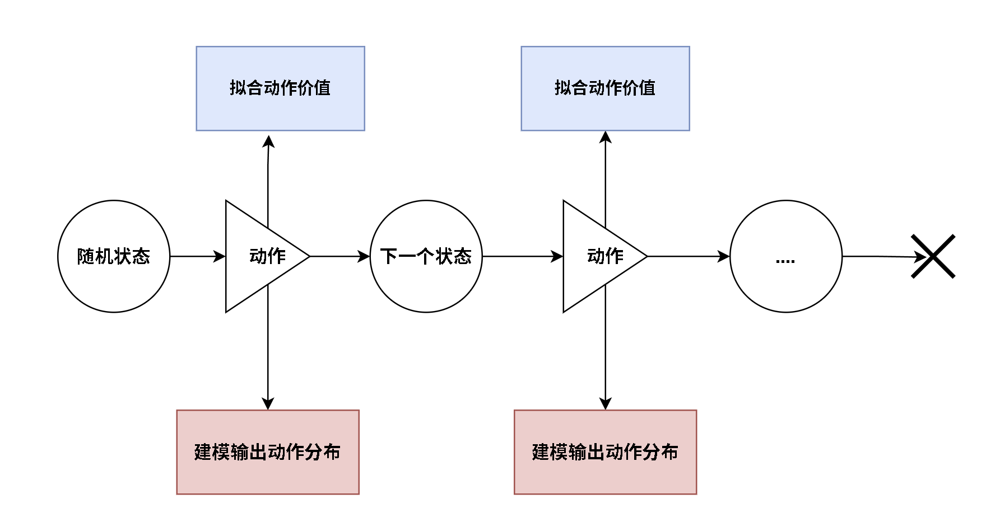
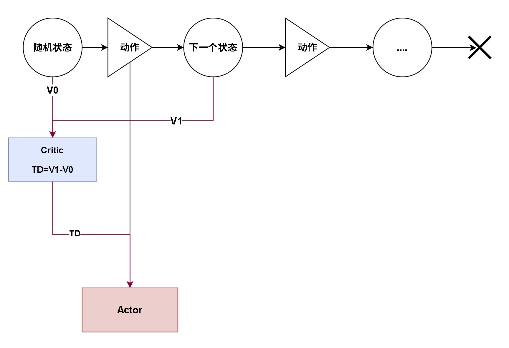

# ActorCritic算法

## ActorCritic 简介

**ActorCritic 是现代深度强化学习的重要基础框架。** TRPO、PPO、DDPG、SAC 等算法都可以看作在 ActorCritic 框架上，对策略目标、价值估计或正则项进行改进。


ActorCritic 结合了两条学习路线：

1. **策略梯度方法**：使用策略网络直接表示动作分布 $\pi_\theta(a|s)$，目标是提高高回报动作的选择概率；
2. **价值方法**：使用价值网络估计状态或状态动作对的长期回报，为策略更新提供评价信号。



Actor（演员）负责根据状态选择动作；Critic（评论家）负责评价当前状态或动作的价值。在本实现中，Actor 使用策略网络输出离散动作概率，Critic 使用价值网络拟合**状态价值函数** $V_\omega(s)$。

与 DQN 直接拟合动作价值 $Q(s,a)$ 并选择最大值动作不同，ActorCritic 的 Actor 是学习主线：它直接学习策略；Critic 则作为辅助，评估当前策略并降低策略梯度的方差。

## ActorCritic 更新公式

策略梯度算法使用完整回合的累计折扣回报 $G_t$ 更新策略：

$\mathcal L_{Actor}=-G_t\log\pi_\theta(a_t|s_t)$

策略梯度必须等到回合结束后才能获得 $G_t$，而且蒙特卡洛回报方差较大。ActorCritic 使用 Critic 对下一状态价值的估计构造单步 TD 目标，因此不需要等待完整回报。



### 1. Critic 的 TD 目标和 TD 误差

当前状态的价值估计为：

$V_\omega(s_t)$

单步 TD 目标为：

$y_t=r_t+\gamma V_\omega(s_{t+1})(1-done_t)$

因此 TD Error（时序差分误差）为：

$\delta_t=y_t-V_\omega(s_t)$

当 $\delta_t>0$ 时，实际结果比 Critic 原先预期更好；当 $\delta_t<0$ 时，实际结果比预期更差。Critic 使用均方误差使当前价值估计逼近 TD 目标：

$\mathcal L_{Critic}=\operatorname{MSE}(V_\omega(s_t),y_t)$

### 2. Actor 的策略损失

Actor 使用 TD 误差近似动作优势，而不是直接使用完整回报：

$\mathcal L_{Actor}=-\log\pi_\theta(a_t|s_t)\delta_t$

最小化该损失时：

- 若 $\delta_t>0$，会增大实际动作 $a_t$ 的选择概率；
- 若 $\delta_t<0$，会减小实际动作 $a_t$ 的选择概率；
- $|\delta_t|$ 越大，本次策略更新越明显。

`td.detach()` 将 TD 误差作为 Actor 的固定评价信号，阻止 Actor 损失的梯度反向传播到 Critic。

**总结：** Actor 根据 $\pi_\theta(a|s)$ 选择动作，Critic 学习 $V_\omega(s)$。Critic 计算 TD 误差 $\delta_t$，Actor 再使用该误差更新动作概率。

### 3. 更新公式代码

```cpp
void ActorCritic::TrainGenerateItem2(const QwList& vList)
{

    static int count = 0;

    if (450 < vList.size())
    {
        count++;
        if (3 < count)
        {
            m_bEndGenerateTrain = true;
            return;
        }
    }
    else
    {
        count = 0;
    }

    auto [s0, a, r, s1, done] = QwListToTensor(vList, m_device);

    auto v0 = m_CriticNet->forward(s0);
    auto v1 = r + m_dbGamma * m_CriticNet->forward(s1) * (1 - done);

    auto td = v1 - v0;

    auto action = m_ActorNet->forward(s0).gather(1, a);
    auto logProbs = torch::log(action);
    auto actorLoss = torch::mean(-logProbs * td.detach());

    auto criticLoss = torch::mean(torch::mse_loss(v0, v1.detach()));

    m_pAdamActor->zero_grad();
    m_pAdamCritic->zero_grad();

    actorLoss.backward();
    criticLoss.backward();


    m_pAdamActor->step();
    m_pAdamCritic->step();
}
```

代码中的关键变量与公式对应如下：

- `v0`：当前状态价值 $V_\omega(s_t)$；
- `v1`：TD 目标 $y_t=r_t+\gamma V_\omega(s_{t+1})(1-done_t)$；
- `td`：TD 误差 $\delta_t=v1-v0$；
- `action`：实际执行动作的策略概率 $\pi_\theta(a_t|s_t)$；
- `actorLoss`：$-\operatorname{mean}(\log\pi_\theta(a_t|s_t)\delta_t)$；
- `criticLoss`：$\operatorname{MSE}(V_\omega(s_t),y_t)$。

`gather(1, a)` 从 Actor 输出的所有动作概率中，取出轨迹中实际执行动作的概率。`v1.detach()` 将 TD 目标视为固定标签；`td.detach()` 使 Actor 只更新策略网络，不更新 Critic 网络。

本实现将同一回合的所有交互数据转换成张量后，计算平均 Actor 和 Critic 损失，并分别通过两个 Adam 优化器更新网络。

### 4. 创建 Actor、Critic 和优化器

```cpp
void ActorCritic::GenerateTrainData(int maxCount)
{
    cout << "Currently Actor-Critic" << endl;

    m_dbGamma = 0.98;

    auto input = m_objEnv->GetStateDim();
    auto output = m_objEnv->GetActionDim();

    m_ActorNet = PolicyNet(input, output);
    m_CriticNet = ValueNet(input, 1);

    m_CriticNet->to(m_device);
    m_ActorNet->to(m_device);

    m_pAdamActor = new torch::optim::Adam(
        m_ActorNet->parameters(), { m_dbActorLR });
    m_pAdamCritic = new torch::optim::Adam(
        m_CriticNet->parameters(), { m_dbCriticLR });

    m_ActorNet->train();
    m_CriticNet->train();

    BaseAdvanced::GenerateTrainData(maxCount);

    m_ActorNet->eval();
    m_CriticNet->eval();

    delete m_pAdamActor;
    m_pAdamActor = nullptr;

    delete m_pAdamCritic;
    m_pAdamCritic = nullptr;
}
```

其中 Actor 学习率为 `m_dbActorLR = 1e-3`，Critic 学习率为 `m_dbCriticLR = 1e-2`，折扣因子为 $\gamma=0.98$。Critic 使用相对较大的学习率，以更快适应 Actor 持续变化的策略。

训练时 Actor 根据概率分布采样动作，评测时选择概率最大的动作。当前实现以连续 4 个回合步数超过 450 作为提前终止条件。

### 5. 运行效果

```cpp


int main()
{
    DeepQNetwork  deepQN;
    //deepQN.Play(400);
    //deepQN.DoubleDQN(400);
    DuelingDQN duelingDQN;
    //duelingDQN.Play(400);

    PolicyGradient policyGradient;
    //policyGradient.Play(1000);

    ActorCritic actorCritic;
    actorCritic.Play(1000);

}

/**

Currently Actor-Critic
GenerateTrainData .....
train i: 80 / 1000 , rewardCount: 11
train i: 100 / 1000 , rewardCount: 15
train i: 120 / 1000 , rewardCount: 41
train i: 140 / 1000 , rewardCount: 13
train i: 160 / 1000 , rewardCount: 50
train i: 180 / 1000 , rewardCount: 37
train i: 200 / 1000 , rewardCount: 19
train i: 220 / 1000 , rewardCount: 29
train i: 240 / 1000 , rewardCount: 51
train i: 260 / 1000 , rewardCount: 76
train i: 280 / 1000 , rewardCount: 38
train i: 300 / 1000 , rewardCount: 49
train i: 320 / 1000 , rewardCount: 124
train i: 340 / 1000 , rewardCount: 54
train i: 360 / 1000 , rewardCount: 148
train i: 380 / 1000 , rewardCount: 95
train i: 400 / 1000 , rewardCount: 180
train i: 420 / 1000 , rewardCount: 470
train i: 440 / 1000 , rewardCount: 212
train i: 460 / 1000 , rewardCount: 233
train i: 480 / 1000 , rewardCount: 249
train i: 500 / 1000 , rewardCount: 470
train i: 520 / 1000 , rewardCount: 146
train i: 540 / 1000 , rewardCount: 394
train i: 560 / 1000 , rewardCount: 470
train i: 579, break Generate Train ####

TestData .....
count: 1 , rewardCount: 492
count: 2 , rewardCount: 500
count: 3 , rewardCount: 500
count: 4 , rewardCount: 500
count: 5 , rewardCount: 500
count: 6 , rewardCount: 500
count: 7 , rewardCount: 500
count: 8 , rewardCount: 500
count: 9 , rewardCount: 500
count: 10 , rewardCount: 500
count: 11 , rewardCount: 500
count: 12 , rewardCount: 500
count: 13 , rewardCount: 500
count: 14 , rewardCount: 500
count: 15 , rewardCount: 500
count: 16 , rewardCount: 500
count: 17 , rewardCount: 500
count: 18 , rewardCount: 500
count: 19 , rewardCount: 500
count: 20 , rewardCount: 500
count: 21 , rewardCount: 500
count: 22 , rewardCount: 500
count: 23 , rewardCount: 500
count: 24 , rewardCount: 444
count: 25 , rewardCount: 500
count: 26 , rewardCount: 492
count: 27 , rewardCount: 500
count: 28 , rewardCount: 500
count: 29 , rewardCount: 500
count: 30 , rewardCount: 410
count: 31 , rewardCount: 500
count: 32 , rewardCount: 500
count: 33 , rewardCount: 500
count: 34 , rewardCount: 500
count: 35 , rewardCount: 396
count: 36 , rewardCount: 500
count: 37 , rewardCount: 500
count: 38 , rewardCount: 500
count: 39 , rewardCount: 500
count: 40 , rewardCount: 500
count: 41 , rewardCount: 500
count: 42 , rewardCount: 421
count: 43 , rewardCount: 500
count: 44 , rewardCount: 500
count: 45 , rewardCount: 500
count: 46 , rewardCount: 500
count: 47 , rewardCount: 435
count: 48 , rewardCount: 486
count: 49 , rewardCount: 500
count: 50 , rewardCount: 500
count: 51 , rewardCount: 500
count: 52 , rewardCount: 500
count: 53 , rewardCount: 500
count: 54 , rewardCount: 500
count: 55 , rewardCount: 462
count: 56 , rewardCount: 500
count: 57 , rewardCount: 500
count: 58 , rewardCount: 500
count: 59 , rewardCount: 500
count: 60 , rewardCount: 500
count: 61 , rewardCount: 500
count: 62 , rewardCount: 391
count: 63 , rewardCount: 500
count: 64 , rewardCount: 500
count: 65 , rewardCount: 430
count: 66 , rewardCount: 500


**/

```
