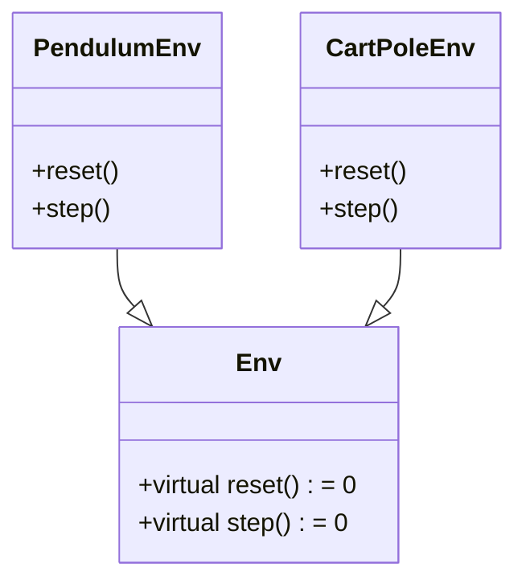
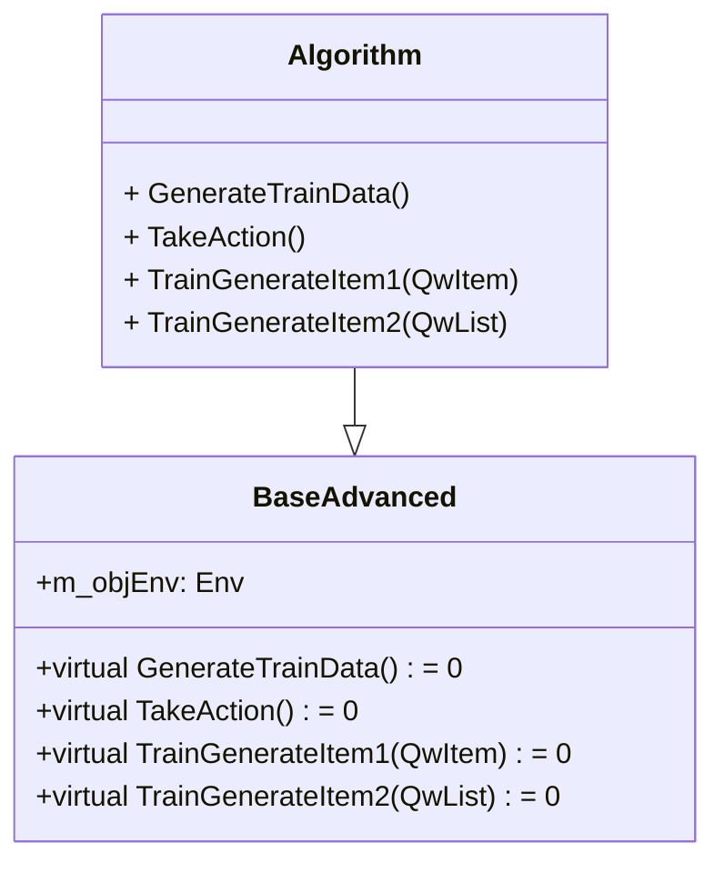
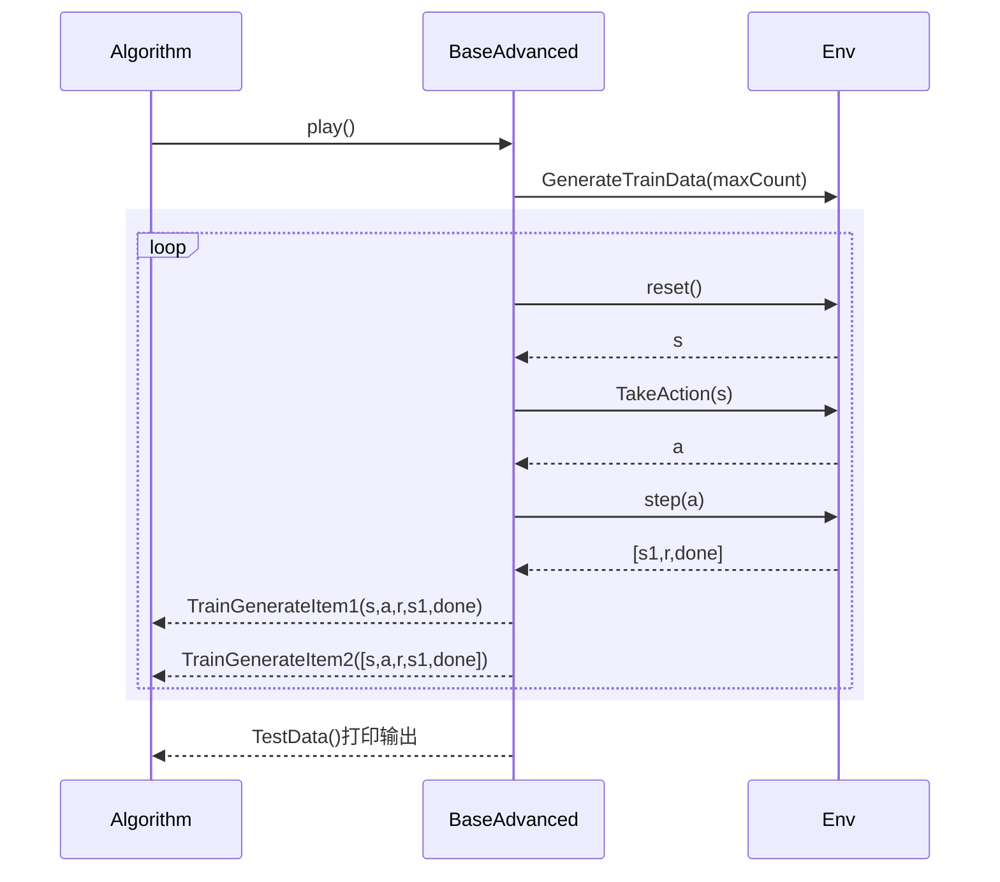

# 进阶篇简介

  本进阶篇章聚焦**深度学习与强化学习的融合应用**，将重点讲解强化学习算法原理推导和代码的实现,以下列举各算法特点

| 算法              | 综合难度   | 环境       | 学习建议  |
|:---------------:|:------ |:--------:|:-----:|
| DQN/DoubleDQN   | ⭐⭐     | 车杆/离散动作  | 基础/过度 |
| DuelingDQN      | ⭐⭐     | 车杆/离散动作  | 过度    |
| 策略梯度（REINFORCE） | ⭐⭐⭐    | 车杆/离散动作  | 过度    |
| Actor‑Critic    | ⭐⭐⭐    | 车杆/离散动作  | 精通    |
| TRPO            | ⭐⭐⭐⭐⭐⭐ | 车杆/离散动作  | 理解原理  |
| PPO             | ⭐⭐⭐    | 车杆/离散动作  | 精通    |
| DDPG            | ⭐⭐⭐    | 倒立摆/连续动作 | 精通    |
| SAC             | ⭐⭐⭐⭐   | 倒立摆/连续动作 | 精通    |

以上算法与环境交互有很多相同的地方，算法实现不一样，这样可以弄个基础类，让子类实现算法。以下面详细介绍**环境**和**代码框架**


# 环境

车杆(CartPole) 环境 ，它的状态值就是连续的，动作值是离散的。

倒立摆环境，它的状态值就是连续的，动作值也是连续的。


## 车杆(动作值是离散的)


在车杆环境中，有一辆小车，智能体的任务是通过左右移动保持车上的杆竖直，若杆的倾斜度数过大，或者车子离初始位置左右的偏离程度过大，或者坚持时间到达 500 帧，则游戏结束。智能体的状态是一个维数为 4 的向量，每一维都是连续的，其动作是离散的，动作空间大小为 2。在游戏中每坚持一帧，智能体能获得分数为 1 的奖励，坚持时间越长，则最后的分数越高，坚持 500 帧即可获得最高的分数。


**CartPole环境的状态空间**

| 维度  | 意义     | 最小值     | 最大值     |
|:---:|:------:|:-------:|:-------:|
| 0   | 车的位置   | -2.4    | 2.4     |
| 1   | 车的速度   | -Inf    | Inf     |
| 2   | 杆的角度   | ~-41.8° | ~ 41.8° |
| 3   | 杆尖端的速度 | -Inf    | Inf     |

**CartPole环境的动作空间**

| 标号  | 动作     |
|:---:|:------:|
| 0   | 向左移动小车 |
| 1   | 向右移动小车 |


**环境交互数据**

| 编号  | 字段类型           | 说明        |
|:---:|:--------------:|:--------- |
| 0   | vector<double> | 状态：4维     |
| 1   | double         | 动作：0或1    |
| 2   | double         | 奖励：1或0    |
| 3   | vector<double> | 下个状态：4维   |
| 4   | double         | 是否结束：1表结束 |


## **倒立摆(动作值是连续)**


环境的状态包括倒立摆角度的正弦值$sin \theta$，余弦值$cos\theta$ ，角速度$\theta$；动作为对倒立摆施加的力矩，每一步都会根据当前倒立摆的状态的好坏给予智能体不同的奖励,奖励函数为$-(\theta^2+0.1\theta+0.001a^2)$倒立摆向上保持直立不动时奖励为 0，倒立摆在其他位置时奖励为负数。环境本身没有终止状态，运行 200 步后游戏自动结束。


**环境的状态空间**

| 标号  | 名称           | 最小值  | 最大值 |
|:---:|:------------:|:----:|:---:|
| 0   | $sin\theta$  | -1.0 | 1.0 |
| 1   | $cos \theta$ | -1.0 | 1.0 |
| 2   | $\theta$     | -8.0 | 8.0 |

**环境的动作空间**

| 标号  | 动作  | 最小值  | 最大值 |
|:---:|:---:|:----:|:---:|
| 0   | 力矩  | -2.0 | 2.0 |

**环境交互数据**

| 编号  | 字段类型           | 说明            |
|:---:|:--------------:|:------------- |
| 0   | vector<double> | 状态：3维         |
| 1   | double         | 动作：-2.0 到 2.0 |
| 2   | double         | 奖励：$\le 0$    |
| 3   | vector<double> | 下个状态：3维       |
| 4   | double         | 0             |

**运行 200 步后自动结束**


# 代码框架

## 环境类




## 算法类

**结构图**




**时序图**



**Algorithm具体指：** DQN、DoubleDQN、DuelingDQN、策略梯度、Actor‑Critic、TRPO、PPO、DDPG、SAC 。

**接口说明**

- ``void GenerateTrainData(int maxCount)`` 算法初始化
- ``double TakeAction(VectorDouble& s0, bool bPredict)`` 实现动作
- ``void TrainGenerateItem1(const QwItem& item)`` 训练数据-单步
- ``void TrainGenerateItem2(const QwList& vList)`` 训练数据-完整回合  

## 

## 本地数据转张量

```c++ 
QwItemTensor QwListToTensor(const QwList& item, const torch::DeviceType& device,bool bCont)
{
    // bCont=ture 是连续动作
    int64_t B = item.size();
    VectorDouble vS0;
    VectorDouble vS1;
    VectorDouble vA;
    VectorDouble vD;
    VectorDouble vR;
    int M = get<0>(item[0]).size();
    vS0.reserve(B* M);
    vS1.reserve(B * M);
    vA.reserve(B);
    vD.reserve(B);
    vR.reserve(B);

    for (auto& i :item)
    {
        auto [s0,a,r,s1, done] = i;  // s0, a, r, s1, done
        vS0.insert(vS0.end(), s0.begin(), s0.end());
        vS1.insert(vS1.end(), s1.begin(), s1.end());
        vA.push_back(a);
        vD.push_back(done);
        vR.push_back(r);
    }

    auto S0 = torch::tensor(vS0, torch::kFloat32).reshape({ B, M}).to(device);
    auto S1 = torch::tensor(vS1, torch::kFloat32).reshape({ B, M }).to(device);
    auto R = torch::tensor(vR, torch::kFloat32).reshape({ B, 1 }).to(device);
    torch::Tensor A;
    if (bCont)
    {
        A = torch::tensor(vA, torch::kFloat32).reshape({ B, 1 }).to(device);
    }
    else
    {
        A = torch::tensor(vA, torch::kLong).reshape({ B, 1 }).to(device);
    }
     

    auto E = torch::tensor(vD, torch::kFloat32).reshape({ B, 1 }).to(device);


    return { S0,A,R,S1, E};

}


```


# 代码下载

[强化学习-进阶篇示例代码资源](https://download.csdn.net/download/qq00769539/93326504?spm=1011.2124.3001.6210)


