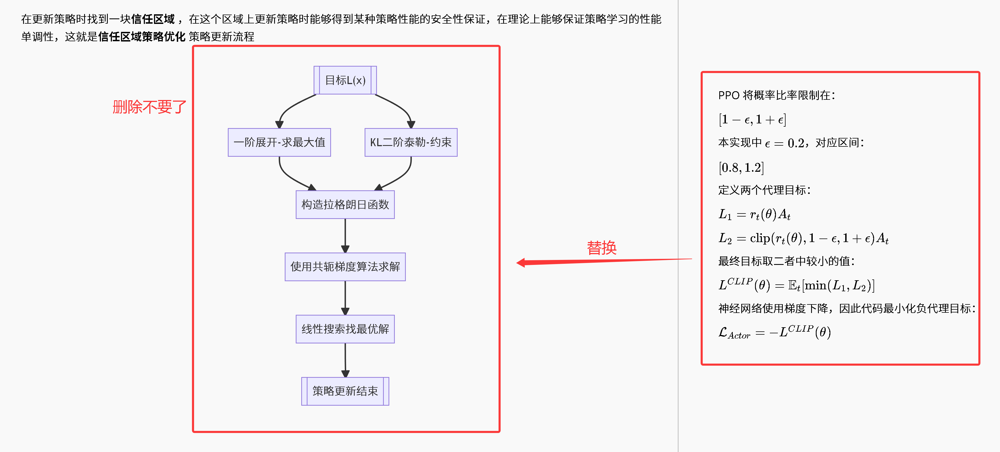

# PPO 简介

普通 ActorCritic 使用策略梯度更新 Actor：

$\mathcal L_{Actor}=-\log\pi_\theta(a_t|s_t)\delta_t$

如果一次参数更新过大，新策略可能与采集数据时的旧策略差异过大，导致策略性能突然下降。

TRPO 使用 KL 散度构造信赖域，通过 Hessian 向量积、共轭梯度和回溯线搜索限制策略变化。TRPO 更新稳定，但二阶优化过程复杂，计算量也比较大。

PPO（Proximal Policy Optimization，近端策略优化）保留了“新策略不能离旧策略太远”的思想，但使用一阶优化器 Adam 直接训练，不再计算 Hessian 矩阵相关信息。PPO有两种形式**PPO-惩罚** 和**PPO-截断** ，PPO是在TRPO的基础上作减法。

PPO 常用的实现是 **PPO-Clip**。它通过裁剪新旧策略的概率比率，限制一次更新对策略产生的影响：

$r_t(\theta)=\frac{\pi_\theta(a_t|s_t)}{\pi_{\theta_{old}}(a_t|s_t)}$

$L^{CLIP}(\theta)=\mathbb E_t\left[\min\left(r_t(\theta)A_t,\operatorname{clip}(r_t(\theta),1-\epsilon,1+\epsilon)A_t\right)\right]$

其中 $\epsilon$ 是裁剪范围，本实现使用 $\epsilon=0.2$。

**总结：** PPO 使用裁剪代理目标限制策略变化，兼顾了策略更新的稳定性和实现的简单性，是目前最常用的策略梯度算法之一。


# PPO 公式推导

## 0. 回顾TRPO




## 1. 重要性采样比率

一批轨迹由旧策略 $\pi_{\theta_{old}}$ 采样得到。Actor 更新后，需要使用同一批数据评价新策略 $\pi_\theta$，因此引入重要性采样比率：

$r_t(\theta)=\frac{\pi_\theta(a_t|s_t)}{\pi_{\theta_{old}}(a_t|s_t)}$

代码通过对数概率计算该比率：

$r_t(\theta)=\exp\left(\log\pi_\theta(a_t|s_t)-\log\pi_{\theta_{old}}(a_t|s_t)\right)$

比率含义：

- $r_t(\theta)=1$：新旧策略对动作 $a_t$ 给出的概率相同；
- $r_t(\theta)>1$：新策略提高了动作 $a_t$ 的概率；
- $r_t(\theta)<1$：新策略降低了动作 $a_t$ 的概率。

不加限制的代理目标为：

$L^{CPI}(\theta)=\mathbb E_t\left[r_t(\theta)A_t\right]$


## 2. 裁剪代理目标

PPO 将概率比率限制在：

$[1-\epsilon,1+\epsilon]$

本实现中 $\epsilon=0.2$，对应区间：

$[0.8,1.2]$

定义两个代理目标：

$L_1=r_t(\theta)A_t$

$L_2=\operatorname{clip}(r_t(\theta),1-\epsilon,1+\epsilon)A_t$

最终目标取二者中较小的值：

$L^{CLIP}(\theta)=\mathbb E_t[\min(L_1,L_2)]$

神经网络使用梯度下降，因此代码最小化负代理目标：

$\mathcal L_{Actor}=-L^{CLIP}(\theta)$


## 3. 裁剪的直观含义

当优势 $A_t>0$ 时，说明动作 $a_t$ 比预期好，应该增大该动作概率。但是当比率超过 $1+\epsilon$ 后，继续增大概率不会继续提高裁剪目标。

当优势 $A_t<0$ 时，说明动作 $a_t$ 比预期差，应该减小该动作概率。但是当比率低于 $1-\epsilon$ 后，继续减小概率不会继续提高裁剪目标。

因此 PPO 不是简单地把所有比率强制限制在区间内，而是通过 `min` 构造一个保守目标，避免策略为了提高当前批次的收益而发生过大变化。


## 4. GAE 优势估计

首先使用 Critic 计算 TD 误差：

$\delta_t=r_t+\gamma V_\omega(s_{t+1})(1-done_t)-V_\omega(s_t)$

再从回合末尾向前递推 GAE：

$A_t=\delta_t+\gamma\lambda A_{t+1}$

展开后为：

$A_t=\delta_t+\gamma\lambda\delta_{t+1}+(\gamma\lambda)^2\delta_{t+2}+\cdots$

其中：

- $\gamma=0.98$：奖励折扣因子；
- $\lambda=0.95$：GAE 参数，用于平衡偏差与方差。
  
  

# PPO 实现细节

## 0. Actor 和 Critic 网络

PPO 使用 ActorCritic 结构：

```cpp
PolicyNet m_ActorNet;
ValueNet m_CriticNet;
```

Actor 使用 `PolicyNet`，输入状态并输出离散动作概率：

$\pi_\theta(\cdot|s)=[P(a_0|s),P(a_1|s),\ldots]$

Critic 使用 `ValueNet`，输入状态并输出一个状态价值：

$V_\omega(s)$

Actor 根据裁剪代理目标更新，Critic 根据 TD 目标更新。


## 1. PPO 超参数

```cpp
const double m_dbActorLR = 1e-3;
const double m_dbCriticLR = 1e-2;
const double m_dbLmbda = 0.95;
const double m_dbEps = 0.2;
const int m_nPPOEpochs = 10;
```

各参数作用如下：

- `m_dbActorLR`：Actor 学习率；
- `m_dbCriticLR`：Critic 学习率；
- `m_dbLmbda`：GAE 中的 $\lambda$；
- `m_dbEps`：PPO 概率比率的裁剪参数 $\epsilon$；
- `m_nPPOEpochs`：同一批轨迹重复训练 Actor 的次数。
  
  

## 2. 创建网络和优化器

```cpp
void PPO::GenerateTrainData(int maxCount)
{
    cout << "Currently PPO" << endl;

    m_dbGamma = 0.98;

    auto input = m_objEnv->GetStateDim();
    auto output = m_objEnv->GetActionDim();

    m_ActorNet = PolicyNet(input, output);
    m_CriticNet = ValueNet(input, 1);

    m_CriticNet->to(m_device);
    m_ActorNet->to(m_device);

    m_pAdamActor = new torch::optim::Adam(m_ActorNet->parameters(), { m_dbActorLR });
    m_pAdamCritic = new torch::optim::Adam(m_CriticNet->parameters(), { m_dbCriticLR });

    m_ActorNet->train();
    m_CriticNet->train();

    BaseAdvanced::GenerateTrainData(maxCount);

    m_ActorNet->eval();
    m_CriticNet->eval();

    delete m_pAdamActor;
    m_pAdamActor = nullptr;

    delete m_pAdamCritic;
    m_pAdamCritic = nullptr;
}
```


## 3. 根据 Actor 选择动作

```cpp
double PPO::TakeAction(VectorDouble& s0, bool bPredict)
{
    torch::NoGradGuard no_grad;
    auto s = VectorDoubleTensor(s0, m_device);
    auto logits = m_ActorNet->forward(s);
    torch::Tensor action;

    if (bPredict)
    {
        action = logits.argmax(-1);
    }
    else
    {
        Categorical categorical(logits);
        action = categorical.sample();
    }

    return action.item<int>();
}
```

训练时按照 Actor 输出的类别分布采样动作，评测时选择概率最大的动作。


## 4. 计算 TD 目标并更新 Critic

```cpp
auto [s0, a, r, s1, done] = QwListToTensor(vList, m_device);

auto v0 = m_CriticNet->forward(s0);
auto v1 = r + m_dbGamma * m_CriticNet->forward(s1).detach() * (1 - done);
auto td = v1 - v0;

auto criticLoss = torch::mean(torch::mse_loss(v0, v1.detach()));
m_pAdamCritic->zero_grad();
criticLoss.backward();
m_pAdamCritic->step();
```

Critic 的 TD 目标为：

$y_t=r_t+\gamma V_\omega(s_{t+1})(1-done_t)$

Critic 损失为：

$\mathcal L_{Critic}=\operatorname{MSE}(V_\omega(s_t),y_t)$

`done=1` 时不再加入下一状态价值。`detach()` 将 TD 目标作为固定标签，避免梯度通过 $V(s_{t+1})$ 传播。

本实现每个回合先更新一次 Critic，再使用更新前计算出的 TD 误差生成优势。


## 5. 计算 GAE

```cpp
torch::Tensor PPO::ComputeAdvantage(double gamma, double lmbda, torch::Tensor& td)
{
    auto device = td.device();
    td.detach_();
    td = td.cpu().contiguous();

    auto n = td.size(0);
    auto m = td.size(1);
    std::vector<float> advantages(static_cast<size_t>(n * m));

    for (int64_t col = 0; col < m; ++col)
    {
        double adv = 0.0;
        for (int64_t i = n - 1; i >= 0; --i)
        {
            double delta = (m == 1)? td[i].item<double>(): td[i][col].item<double>();
            adv = gamma * lmbda * adv + delta;
            advantages[static_cast<size_t>(i * m + col)] = static_cast<float>(adv);
        }
    }

    auto options = torch::TensorOptions().dtype(torch::kFloat32);
    auto adv = torch::from_blob(advantages.data(), { n, m }, options).clone();
    return adv.to(device);
}
```

代码从轨迹最后一步向前计算：

$adv\leftarrow\delta_t+\gamma\lambda adv$

`td.detach_()` 切断优势与 Critic 计算图的连接，因为优势只作为 Actor 损失中的固定权重。


## 6. 优势归一化

```cpp
auto adv = ComputeAdvantage(m_dbGamma, m_dbLmbda, td);

auto mean = adv.mean();
auto std = adv.std();
auto adv_norm = ((adv - mean) / (std + 1e-8)).detach();
```

归一化公式为：

$\hat A_t=\frac{A_t-\operatorname{mean}(A)}{\operatorname{std}(A)+10^{-8}}$

优势归一化使当前批次的优势均值接近 $0$、标准差接近 $1$，减少奖励尺度和不同回合长度对 Actor 更新幅度的影响。

分母加入 $10^{-8}$，防止标准差为 $0$ 时出现除零。最后调用 `detach()`，确保 Actor 更新不会影响 Critic。


## 8. 计算新旧策略概率比率

```cpp
auto logProbs = torch::log(m_ActorNet->forward(s0).gather(1, a));
auto ratio = torch::exp(logProbs - oldLogProbs);
```

每轮更新都使用当前 Actor 重新计算：

$\log\pi_\theta(a_t|s_t)$

然后得到重要性采样比率：

$r_t(\theta)=\exp\left(\log\pi_\theta(a_t|s_t)-\log\pi_{old}(a_t|s_t)\right)$

第一轮更新前，新旧策略相同，因此 `ratio` 接近 $1$。随着 Actor 被重复更新，`ratio` 会逐渐偏离 $1$，裁剪机制开始限制过大的策略变化。


## 9. PPO 裁剪损失

```cpp
auto surr1 = ratio * adv_norm;
auto surr2 = torch::clamp(ratio, 1.0 - m_dbEps, 1.0 + m_dbEps) * adv_norm;
auto actorLoss = torch::mean(-torch::min(surr1, surr2));
```

代码对应以下公式：

$surr1=r_t(\theta)\hat A_t$

$surr2=\operatorname{clip}(r_t(\theta),0.8,1.2)\hat A_t$

$\mathcal L_{Actor}=-\operatorname{mean}\left(\min(surr1,surr2)\right)$

取 `min` 表示使用更保守的代理目标，负号将最大化目标转换成优化器需要最小化的损失。


## 10. 使用同一批数据训练多轮

```cpp
for (int i = 0; i < m_nPPOEpochs; i++)
{
    auto logProbs = torch::log(m_ActorNet->forward(s0).gather(1, a));
    auto ratio = torch::exp(logProbs - oldLogProbs);
    auto surr1 = ratio * adv_norm;
    auto surr2 = torch::clamp(ratio, 1.0 - m_dbEps,1.0 + m_dbEps) * adv_norm;
    auto actorLoss = torch::mean(-torch::min(surr1, surr2));

    m_pAdamActor->zero_grad();
    actorLoss.backward();
    m_pAdamActor->step();
}
```

本实现对同一个回合的数据重复训练 Actor 10 次(`m_nPPOEpochs`人为定义)。这样可以提高当前轨迹的样本利用率。

每一轮都重新计算新策略概率和 `ratio`，但旧策略概率 `oldLogProbs`、优势 `adv_norm` 保持不变。裁剪目标用于限制多轮训练过程中策略偏离旧策略的程度。


## 11. 完整训练流程

`TrainGenerateItem2()` 的主要流程为：

1. 将当前回合轨迹转换成张量；
2. 计算 TD 目标、TD 误差和 Critic 损失；
3. 更新一次 Critic；
4. 根据 TD 误差计算 GAE；
5. 对优势进行归一化；
6. 保存旧策略动作对数概率；
7. 使用裁剪代理目标重复更新 Actor 10 次；
8. 使用更新后的策略重新采集下一回合数据。
   
   

## 12. 训练终止条件

```cpp
static int count = 0;

if (450 < vList.size())
{
    count++;
    if (3 < count)
    {
        m_bEndGenerateTrain = true;
        return;
    }
}
else
{
    count = 0;
}
```

当单回合步数超过 450 时，`count` 加 $1$；如果某个回合没有达标，`count` 清零。连续 4 个回合超过 450 后结束训练。

**训练终止条件：** 达到最大迭代次数，或连续 4 个回合的步数超过 450。


## PPO 与 TRPO 的区别

| 项目          | TRPO       | PPO-Clip |
| ----------- | ---------- | -------- |
| 策略约束        | 显式 KL 散度约束 | 裁剪概率比率   |
| 优化方式        | 二阶近似       | 一阶梯度优化   |
| Actor 更新    | 共轭梯度、线搜索   | Adam     |
| Hessian 向量积 | 需要         | 不需要      |
| 回溯线搜索       | 需要         | 不需要      |
| 优势估计        | GAE        | GAE      |
| 同批数据多轮更新    | 通常受信赖域控制   | 使用裁剪目标控制 |
| 实现复杂度       | 较高         | 较低       |

TRPO 显式要求平均 KL 散度小于指定阈值，理论约束更直接；PPO 使用裁剪概率比率近似限制策略变化，实现更简单，并且可以使用常规的小批量梯度优化方法。


