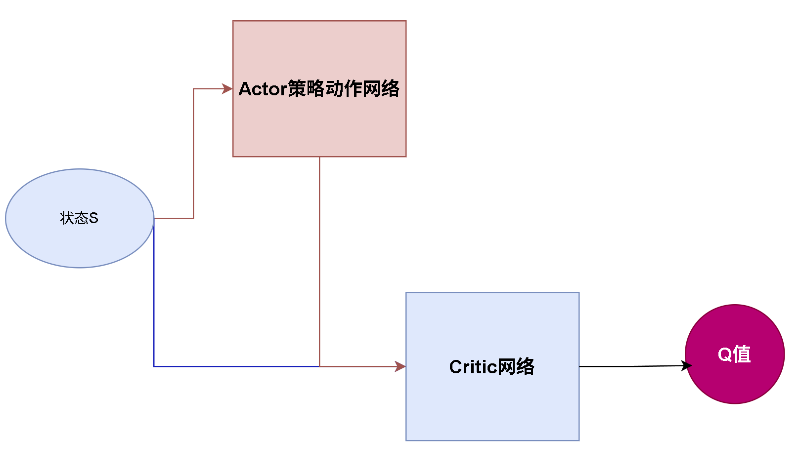

# Pendulum-v1 评测评级表

> Pendulum-v1 原始奖励范围：每步奖励 \([-16.27, 0]\)，每回合固定为 200 步，理论单回合最高总分 0，最低约 -3254。下面为**100 回合平均奖励**。

| 评级    | 100 回合平均奖励  | 表现说明                                 |
| ----- | ----------- | ------------------------------------ |
| S（完美） | >−100       | 摆杆几乎全程直立稳定，角度、角速度控制很好，几乎无大幅度摆动       |
| A（优秀） | −100∼−300   | 摆杆基本保持直立，小幅震荡，偶尔有倾斜，能稳定维持平衡，几乎不会完全倒下 |
| B（良好） | −300∼−600   | 可以拉起倒立摆并维持一段时间平衡，存在明显摆动，部分回合会倾倒，整体可控 |
| C（合格） | −600∼−1000  | 能够将摆杆拉起至接近直立，但维持平衡能力弱，频繁倾倒，稳定性差      |
| D（较差） | −1000∼−2000 | 很难稳定拉起倒立摆，多数回合摆杆长时间朝下，偶尔短暂立起很快倒下     |
| E（失败） | <−2000      | 几乎无法拉起摆杆，摆持续下垂，策略基本无效，随机水平附近         |

# DDPG 算法简介

DQN 适用于离散动作空间。以车杆环境为例，动作只有向左和向右，可以让神经网络输出所有动作的 $Q$ 值，再选择其中最大的动作。但是在连续动作环境中，动作可能是一个任意实数。例如控制摆锤时，力矩可以取 $[-2,2]$ 之间的任意值。如何处理连续动作？回顾一下当处理连续状态时把状态作为网络的输入层，输出所有动作的 $Q$ 值，同理把**连续动作当成另一个状态** 作为网络的输入层，最后输出所有动作的 $Q$ 值。用一个策略动作网络输出动作。




DDPG（Deep Deterministic Policy Gradient，深度确定性策略梯度）使用 ActorCritic 结构解决连续动作问题，一共4个网络

- 在线Actor网络

- 目标Actor网络

- 在线Critic网络

- 目标Critic网络
  
  

## 策略动作网络

- 函数基础
  $\tanh(x)=\frac{e^x - e^{-x}}{e^x + e^{-x}}$
  值域：$\boldsymbol{(-1,1)}$，奇函数；输入很大时趋近 $\pm1$。

- 实现代码 
  
  ```cpp
  class PolicyNetContImpl : public torch::nn::Module
  {
  public:
  
      PolicyNetContImpl() = default;
      PolicyNetContImpl(int64_t input,int64_t output, double actionBound, int64_t hidden = 128)
      {
          m_fc1 = register_module("fc1",torch::nn::Linear(input, hidden));
          m_fc2 = register_module("fc2",torch::nn::Linear(hidden, output));
          m_dbActionBound = actionBound;
      }
  
      torch::Tensor forward(torch::Tensor x)
      {
          x = torch::relu(m_fc1->forward(x));
  
          return m_dbActionBound * torch::tanh(m_fc2->forward(x));
      }
  
  private:
      torch::nn::Linear m_fc1{ nullptr };
      torch::nn::Linear m_fc2{ nullptr };
      double m_dbActionBound = 2.0;
  };
  
  TORCH_MODULE(PolicyNetCont);
  
  ```

## Critic网络

```cpp
class QValueNetContImpl : public torch::nn::Module
{
public:
    QValueNetContImpl() = default;

    QValueNetContImpl(int64_t input,int64_t output,int64_t hidden = 128)
    {
        m_fc1 = register_module("fc1", torch::nn::Linear(input + output, hidden));

        m_fc2 = register_module("fc2",torch::nn::Linear(hidden, hidden));

        m_output = register_module("output",torch::nn::Linear(hidden, 1));
    }

    torch::Tensor forward( const torch::Tensor& state,const torch::Tensor& action)
    {
        auto x = torch::cat({ state, action }, 1);

        x = torch::relu(m_fc1->forward(x));
        x = torch::relu(m_fc2->forward(x));

        return m_output->forward(x);
    }

private:
    torch::nn::Linear m_fc1{ nullptr };
    torch::nn::Linear m_fc2{ nullptr };
    torch::nn::Linear m_output{ nullptr };
};

TORCH_MODULE(QValueNetCont);

```

## 软更新

$\boldsymbol{\theta_{target} \leftarrow \tau\,\theta_{online}+(1-\tau)\theta_{target}},\quad \tau\ll1$ 

每一步训练完，都轻微平滑更新 target 参数（常用 $\tau=0.005$）

> 硬更新 vs 软更新 对比表
> 
> | 对比项        | 硬更新（Hard Update）               | 软更新（Soft Update）                 |
> | ---------- | ------------------------------ | -------------------------------- |
> | **公式**     | θtgt​←θonline​                 | θtgt​←τθonline​+(1−τ)θtgt​,0<τ≪1 |
> | **更新时机**   | 每隔固定步数（如 1000 步）一次性拷贝          | **每一步训练后**都微小更新                  |
> | **参数变化**   | 目标网络长时间冻结，更新瞬间**剧烈跳变**         | 目标网络缓慢平滑跟踪 online，**无突变**        |
> | **原版使用算法** | DQN、Double DQN、Dueling DQN（原生） | DDPG、TD3、SAC（原生）                 |
> | **计算开销**   | 平时无开销；到点一次性拷贝参数                | 每轮都遍历全部参数加权，微小额外开销               |
> | **训练效果**   | 目标长时间固定，更新时刻目标 y 突然跳变，容易震荡     | 目标缓慢漂移，y波动更小，训练更平稳               |
> | **缺点**     | 目标值突变，可能引发震荡；间隔内 target 完全不学习  | τ过大容易发生自举、发散；τ太小学习变慢             |
> | **适用场景**   | 简单 DQN 实验，不想每步额外计算；低算力环境       | 追求训练曲线平滑；连续控制算法（SAC/DDPG/TD3）    |
> | **代码特点**   | 加 step 计数器判断，满足条件再复制           | 无需计数器，训练结束直接循环参数加权               |

```cpp

void DDPG::SoftUpdate(torch::nn::Module& source,torch::nn::Module& target)
{
    torch::NoGradGuard noGrad;

    auto sourceParameters = source.parameters();
    auto targetParameters = target.parameters();

    TORCH_CHECK(sourceParameters.size() == targetParameters.size(),"DDPG::SoftUpdate: parameter count mismatch");

    for (size_t i = 0; i < sourceParameters.size(); ++i)
    {
        targetParameters[i].mul_(1.0 - m_tau);
        targetParameters[i].add_(sourceParameters[i],m_tau);
    }
}

```

## 连续动作探索

确定性策略本身不会随机探索，因此训练时在 Actor 动作上加入高斯噪声：

$a=\operatorname{clip}(\mu_\theta(s)+\epsilon,a_{low},a_{high})$

$\epsilon\sim\mathcal N(0,\sigma^2)$

评测时不加入噪声，直接使用 Actor 输出的动作。

```cpp
double DDPG::TakeAction(VectorDouble& s0,bool bPredict)
{
    torch::NoGradGuard noGrad;

    auto s = VectorDoubleTensor(s0, m_device);
    auto actionTensor = m_actor->forward(s);

    auto action = actionTensor.squeeze().item<double>();

    if (!bPredict)
    {
        auto noise = torch::randn({ m_objEnv->GetActionDim()}, m_device) * m_dbSigma;
        //cout << noise<<endl;
        action = action + noise.squeeze().item<double>();
        action = std::clamp(action, m_objEnv->GetActionLow(), m_objEnv->GetActionHigh());

    }

    return action;
}


```


## 创建初始化`void DDPG::GenerateTrainData(int maxCount)`

```cpp
void DDPG::GenerateTrainData(int maxCount)
{
    cout << "Currently DDPG (continuous)" << endl;

    m_dbGamma = 0.95;
    m_maxMewardCount = 200;
    m_minLogCount = 20;
    m_minLogStep = 6;

    GetReplayDataList().clear();

    m_stateDim = m_objEnv->GetStateDim();
    m_actionDim = m_objEnv->GetActionDim();
    auto actionBound = m_objEnv->GetActionHigh();

    TORCH_CHECK(m_actionDim == 1,"DDPG currently supports only one-dimensional continuous actions");

    m_actor = PolicyNetCont(m_stateDim, m_actionDim, actionBound);
    m_targetActor = PolicyNetCont(m_stateDim, m_actionDim, actionBound);

    m_critic = QValueNetCont(m_stateDim, m_actionDim);
    m_targetCritic = QValueNetCont(m_stateDim, m_actionDim);

    m_actor->to(m_device);
    m_targetActor->to(m_device);

    m_critic->to(m_device);
    m_targetCritic->to(m_device);

    CopyModuleParameters(*m_actor, *m_targetActor);
    CopyModuleParameters(*m_critic, *m_targetCritic);

    m_actorOptimizer = std::make_unique<torch::optim::Adam>(m_actor->parameters(),torch::optim::AdamOptions(m_actorLearningRate));
    m_criticOptimizer = std::make_unique<torch::optim::Adam>(m_critic->parameters(),torch::optim::AdamOptions(m_criticLearningRate));

    m_actor->train();
    m_critic->train();

    m_targetActor->eval();
    m_targetCritic->eval();

    BaseAdvanced::GenerateTrainData(maxCount);

    m_actor->eval();
    m_critic->eval();

    m_actorOptimizer.reset();
    m_criticOptimizer.reset();
}
```


## 训练更新

```cpp

void DDPG::Update()
{
    ReplayBuffer dataTrain;
    auto samples = dataTrain.sample(m_batchSize);
    auto [s0, a, r, s1, done] = QwListToTensor(samples, m_device,true);

    m_dbSigma = std::max(0.02, m_dbSigma * 0.9995);

    torch::Tensor qTargets;
    {
        torch::NoGradGuard noGrad;

        auto q1 = m_targetCritic->forward(s1, m_targetActor->forward(s1));

        qTargets = r + m_dbGamma * q1 * (1.0 - done);
    }

    auto mseloss = torch::nn::MSELoss(torch::nn::MSELossOptions().reduction(torch::kMean));
    auto criticLoss = mseloss->forward(m_critic->forward(s0, a), qTargets);
    m_criticOptimizer->zero_grad();
    criticLoss.backward();
    m_criticOptimizer->step();


    auto actorLoss = -m_critic->forward(s0, m_actor->forward(s0)).mean();
    m_criticOptimizer->zero_grad();
    m_actorOptimizer->zero_grad();
    actorLoss.backward();
    m_actorOptimizer->step();

    SoftUpdate(*m_actor, *m_targetActor);
    SoftUpdate(*m_critic, *m_targetCritic);


}

```


